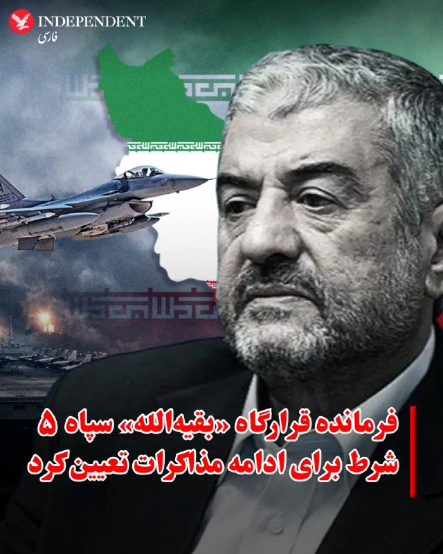

# خواننده تلگرام

<!-- TOP_NAV START -->

<a href="https://github.com/ProAlit/aio-downloader/blob/main/telegram/content/archive_1.md" style="display:inline-block; padding:6px 12px; margin:0 4px; background-color:#2ea44f; color:white; text-decoration:none; border-radius:4px; font-weight:bold;">صفحه بعد</a>

<!-- TOP_NAV END -->

<!-- MSG START -->

---
📅 بروزرسانی: 1405/02/21 18:53
---

## VahidOOnLine — post 239538

  

♦️محمدعلی جعفری، فرمانده قرارگاه «بقیه‌الله» سپاه پاسداران، روز دوشنبه ۲۱ اردیبهشت‌ماه تاکید کرد که جمهوری اسلامی تنها در صورت تحقق شروطی مشخص حاضر به گفتگوهای آتی خواهد بود. او تصریح کرد که تا زمان پایان نیافتن جنگ در تمامی جبهه‌ها، لغو کامل تحریم‌ها و آزادسازی دارایی‌های بلوکه‌شده ایران، مسیر هرگونه مذاکره مجدد بسته خواهد ماند.

فرمانده پیشین کل سپاه همچنین جبران خسارت‌های ناشی از جنگ و رسمیت شناختن حق حاکمیت رژیم ایران بر تنگه هرمز را از دیگر الزامات اساسی پیش از هرگونه توافق جدید دانست.
‌🇸🇦 Indypersian

🤖 @VahidOOnLine

## WithYashar — post 10941

تعنه سنگین ترامپ: الان یک گروه بزرگ از ژنرال‌ها منتظر من هستند؛ دربارهٔ کشور کاملاً دوست‌داشتنیِ ایران.
@withyashar

## WithYashar — post 10940

ترامپ در مصاحبه با CBS News اعلام کرد که قصد دارد مالیات فدرال ۱۸ سنتی بر بنزین را برای مدتی به حالت تعلیق درآورد!
تحلیلگران این اقدام ترامپ را در راستای کنترل قیمت بنزین برای ادامه جنگ با ایران عنوان کرده‌اند.
@withyashar

## WithYashar — post 10939

ترامپ با شوخی گفت:

«شنیده‌ام که “سندرم ترامپ‌هراسی” واقعاً یک بیماری است. باعث افتخار من است.»
@withyashar

## mwarmonitor — post 8904

🔴دو ماه از زمانی که تنگه هرمز عملاً برای ترافیک کانتینری تجاری بسته شده می‌گذرد. داده‌های Kpler نشان می‌دهد:

🔵۵۳ کشتی از ۱۰ شرکت بزرگ حمل‌ونقل جهان در داخل خلیج فارس گرفتار شده‌اند. ۷۹٪ آن‌ها هنوز همان‌جا هستند.

🟢فقط ۹ کشتی توانسته‌اند از منطقه خارج شوند. دو مورد از آن‌ها برای عبور موفق به تلاش دوم نیاز داشتند (هر دو متعلق به COSCO؛ تنها شرکت با موفقیت در خروج). دو کشتی MSC توسط مقامات ایرانی توقیف شدند. یک کشتی نیز بر اثر برخورد با آوار آسیب دید.

🔘جزئیات شرکت‌ها تصویر واقعی را نشان می‌دهد: ◾ CMA CGM: ۱۵ کشتی وارد شده، ۱۳ کشتی هنوز داخل (۸۷٪ گرفتار) ◾ MSC: ۱۴ کشتی وارد شده، ۲ کشتی توقیف شده، ۸ کشتی هنوز داخل ◾ Maersk: ۶ کشتی وارد شده، ۵ کشتی هنوز داخل ◾ COSCO: ۵ کشتی وارد شده، ۲ کشتی با تلاش دوم خارج شده‌اند (تنها موفقیت در خروج) ◾ Wan Hai، Evergreen، Yang Ming، ONE، HMM: هیچ خروجی ثبت نکرده‌اند

🔸این فقط یک اختلال تجاری نیست. این وضعیت به معنای خارج شدن ده‌ها هزار TEU (واحد کانتینر استاندارد) از چرخه فعال حمل‌ونقل است؛ کانتینرهایی که درآمدی ایجاد نمی‌کنند، خدمه را درگیر کرده‌اند و صاحبان کالا را مجبور به بازطراحی کامل زنجیره تأمین کرده‌اند. آنچه Kpler در حال رصد آن است: ترمینال‌هایی که اکنون تجارت خلیج فارس را جذب کرده‌اند و اینکه تا چه مدت می‌توانند این حجم را مدیریت کنند.

🔹۴۲ کشتی باقی‌مانده در داخل، یکی از بزرگ‌ترین تمرکزهای ناخواسته ناوگان در تاریخ مدرن کشتیرانی را تشکیل می‌دهند.

@mwarmonitor

## mwarmonitor — post 8903

🔘تا زمانی که تنگه هرمز ناآرام باقی بماند، نیروی دریایی آمریکا هر بار که یک ناوشکن را از این آبراه عبور می‌دهد با میلیون‌ها دلار هزینه اضافی روبه‌رو می‌شود و چنین عبورهایی به‌تنهایی بعید است بتوانند باعث بازگشایی آن شوند. Bloomberg

@mwarmonitor

## mwarmonitor — post 8902

🔵شبکه CBS به نقل از ترامپ: می‌خواهم مالیات فدرال ۱۸ سنتی روی بنزین را برای مدتی به حالت تعلیق درآورم. @mwarmonitor

## pm_afshaa — post 90557

  <a href="telegram/content/pm_afshaa_90557_1778513017.webm" target="_blank">🎬 Download video</a>

🔴ترامپ: آخرش رهبران تندرو و خشن ایران رو تسلیم می‌کنیم.

💧 Rainbet.com the #1 Non-KYC Crypto Casino & Sportsbook @rainbetcom

😁 @Pm_Afshaa

## pm_afshaa — post 90556

  <a href="telegram/content/pm_afshaa_90556_1778513018.webm" target="_blank">🎬 Download video</a>

🔴ابراهیم رضایی، سخنگوی کمیسیون امنیت ملی مجلس: موضوع «فناوری» هسته‌ای در دستور کار مذاکرات قرار ندارد و غنی‌سازی قابل مذاکره نیست.

💧 Rainbet.com the #1 Non-KYC Crypto Casino & Sportsbook @rainbetcom

😁 @Pm_Afshaa

## IranIntlTV — post 336669

🔻کسب‌وکارها یکی پس از دیگری سقوط می‌کنند

همزمان با تداوم قطعی اینترنت، فشارهای اقتصادی و پیامدهای جنگ، بسیاری از کسب‌وکارها در شهرهای مختلف با کاهش فروش، تعدیل نیرو و حتی خطر تعطیلی مواجه شده‌اند. صاحبان کسب‌وکارها در پیام‌هایی به ایران‌اینترنشنال، وضعیت کنونی را یکی از دشوارترین دوره‌های سال‌های اخیر توصیف کردند.

یک مدرس کاشت ناخن و مانیکور از توقف کسب‌وکار خود از اسفندماه سال گذشته تاکنون خبر داد.

به گفته این شهروند، گرچه مردمی که از تامین نیازهای اولیه خود درمانده شده‌اند، کمتر به خدمات زیبایی می‌پردازند، اما عوامل دیگری نیز در این رکود موثر است؛ از جمله قطعی اینترنت که موجب شده تا او کسب درآمد از طریق فروش پکیج‌های آموزشی را از دست بدهد.

او همچنین توضیح داد از همان زمان تاکنون آنتن دستگاه کارتخوانش قطع شده است و در پاسخ به پیگیری‌هایش گفته‌اند سیگنال دستگاه کارتخوان «مشاغل غیرضروری» به دلایل «امنیتی» تا اطلاع ثانوی قطع خواهد بود.

بحران در صنایع پتروشیمی و بنادر

افزون بر این، پیام‌های رسیده به ایران‌اینترنشنال حاکی از موج گسترده بیکاری و ورشکستگی در کسب‌وکارهای صنعتی و خدماتی وابسته به صنایع سنگین است.

بسیاری از فعالان این حوزه‌ها که تعدیل، اخراج یا بیکار شده‌اند، گفتند همچون دیگر صنف‌هایی که با مشکل اقتصادی مواجه شده‌اند، به مشاغلی نظیر رانندگی در اسنپ یا کارهایی روی آورده‌اند که امنیت شغلی پایین‌تری دارند.

یک شهروند شاغل در حوزه صنعت گفت: «هر کیلو پروفیل پیش از جنگ تا حدود قیمت ۷۰ هزارتومان خریدوفروش می‌شد، اما اکنون قیمت آن به ۱۵۵ هزار تومان رسیده است. به دلیل همین افزایش قیمت مدت سه‌ ماه است که بیکاریم و توان پرداخت هزینه مواد اولیه را نداریم.»

قیمت پروفیل، به‌عنوان ماده اولیه ساخت‌وساز در صنایع طی یک‌سال گذشته افزایش قیمتی ۱۲۰ تا ۱۶۰ درصدی را تجربه کرده است.

مخاطب دیگری که فعال در صنف کابینت‌سازی است، نیز گفت قیمت هر ورق ام‌دی‎‌اف از ۳ میلیون تومان در سال ۱۴۰۴ به ۱۵ تا ۱۷ میلیون تومان در سال جدید رسیده است.

این شهروند با اشاره به رشد ۴۰۰ تا ۴۷۰ درصدی قیمت مواد اولیه، گفت در چنین شرایطی دیگر امکان ادامه کار و پرداخت اجاره محل کسب وجود ندارد.

پیش از این نیز شهروندان از بحران بیکاری در مشاغل مرتبط با پتروشیمی و نبود ورق آهن و مواد پتروشیمی در شهرهایی از جمله اصفهان خبر داده بودند که باعث تعطیلی بسیاری از کارگاه‌های صنعتی شده است.

علاوه بر صنایع، گزارش‌هایی نیز از موج توقف کسب و کارها و تعدیل نیرو در بنادر به دست ایران‌اینترنشنال رسیده است.

یکی از کارکنان بندر رجایی گفت بسیاری از کارگران این منطقه اقتصادی تعدیل شده‌اند و آنها که همچنان سر کار مانده‌اند، حقوق‌هایشان به‌صورت مرتب پرداخت نمی‌شود و بندر بسیار خلوت شده است.

بندر رجایی یکی از مهم‌ترین بنادر تجاری ایران است که اردیبهشت سال ۱۴۰۴ با آنچه انفجار یکی از کانتینرهای حامل مواد شیمیایی خطرناک، از جمله سدیم پرکلرات اعلام شد، دچار آتش‌سوزی شد و به مرگ ده‌ها نفر انجامید.

بسیاری از شرکت‌های پیمانکاری وابسته به این بندر پس از انفجار و تا پیش از جنگ نیز با مشکلات اقتصادی بسیاری دست به گریبان بوده‌اند.

شهروند دیگری از سربندر در پیامی مشابه نوشت تمامی شرکت‌های بندر نیروهای خود را تعدیل کرده‌اند و حقوق افرادی که کماکان بر سر کار مانده‌اند هم به درستی پرداخت نمی‌شود.

پایگاه خبری رویداد ۲۴ نیز ۱۷ اردیبهشت در گزارشی درباره وضعیت مجموعه فولاد مبارکه پس از حملات آمریکا و اسرائیل نوشت که با وجود اطمینان‌دهی اولیه به کارکنان مبنی بر پرداخت بدون مشکل حقوق،دستمزد نیروها به حداقل دستمزد مصوب اداره کار تقلیل یافته است و بسیاری از نیروهای متخصص به رانندگی در تاکسی‌های اینترنتی روی آورده‌اند.

رستوران‌ها تحت تاثیر گرانی

صنف رستوران و غذاخوری‌ها نیز از جمله کسب و کارهایی هستند که با افزایش قیمت مواد اولیه و فشارهای اقتصادی آسیب زیادی دیده‌اند.

یکی از مخاطبان ایران‌اینترنشنال که صاحب یک رستوران فست‌فود در لاهیجان است، نوشت: «مواد اولیه ساندویچی که اکنون به مبلغ ۱۰۰ هزارتومان فروخته می‌شود، چند روز بعد ۱۱۰ هزار تومان خریداری می‌شود. پس ناچار به افزایش قیمت روزانه هستیم که هم موجب نارضایتی مشتری است و هم خود از این مساله آسیب دیده‌ایم.»

رستوران‌دار دیگری از کیش نیز گفت اول ناچار شد بیش از ۱۰ نفر از نیروهایش را تعدیل کند و حالا چاره‌ای جز تعطیلی برایش نمانده است.
هم‌زمان، برخی مخاطبان از افزایش قیمت فست‌فود خبر دادند.

بر اساس این گزارش‌ها، قیمت یک ساندویچ به‌طور متوسط به ۵۰۰ هزار تومان و یک پیتزا به یک میلیون و ۲۰۰ هزار تومان رسیده است.

🔗 وب‌سایت ایران اینترنشنال

@iranintltv

## FarsiVOA — post 217447

  <a href="telegram/content/FarsiVOA_217447_1778513019.mp4" target="_blank">🎬 Download video</a>

سعید پیوندی، جامعه‌شناس آموزشی در میدان: روشنفکرانِ خواستار «بازگشت» در به گل نشستن پروژه نوسازی که فرخ‌رو پارسا نماد آن بود نقش داشتند و در نهایت شاهد پیروزی انقلاب اسلامی شدیم

## FarsiVOA — post 217446

  <a href="telegram/content/FarsiVOA_217446_1778513021.mp4" target="_blank">🎬 Download video</a>

ارتش اسرائیل اعلام کرد نیروهای لشکر ۱۴۶ روز یکشنبه زیرساخت‌ها و یک انبار تسلیحاتی متعلق به حزب‌الله لبنان را منهدم کرد. در این حملات نیروهای حزب‌الله نیز کشته شدند.

ارتش اسرائیل همچنین دو نیروی حزب‌الله را در جنوب لبنان، در یک «ساختمان که برای پیشبرد طرحی تروریستی علیه نیروهای ارتش اسرائیل استفاده می‌شد» شناسایی و حذف کرد.

ارتش اسرائیل از حملات حزب‌الله در ساعات اخیر با راکت و پهپاد انفجاری به نیروهایش در جنوب لبنان خبر داد که تلفات جانی نداشت و موجب خسارت دیدن تجهیزات ارتش شد.

## DW_Farsi — post 124566

🔶 ازسرگیری مذاکرات صلح اوکراین با سفر هیات آمریکایی به مسکو

کرملین اعلام کرده است که استیو ویتکاف، مذاکره‌کننده آمریکایی، و جرد کوشنر، داماد دونالد ترامپ، رئیس جمهور آمریکا، "به‌زودی" برای ادامه مذاکرات درباره پایان جنگ اوکراین وارد مسکو خواهند شد؛ نشانه‌ای تازه از تلاش‌های دولت ترامپ برای پیشبرد روندی که کاخ سفید آن را مقدمه‌ای برای پایان دادن به طولانی‌ترین و خونبارترین جنگ اروپا پس از جنگ جهانی دوم معرفی می‌کند.

یوری اوشاکوف، مشاور کرملین و نماینده روسیه در مذاکرات، روز دوشنبه ۱۱ مه (۲۱ اردیبهشت) در گفت‌وگو با تلویزیون دولتی روسیه، بدون اشاره به تاریخ دقیق سفر هیات آمریکایی، گفت آتش‌بس سه‌روزه اخیر میان روسیه و اوکراین نتیجه تماس‌های تلفنی "نه چندان آسان" میان مسکو و واشنگتن بوده است.
@dw_farsi

## Persian_Trend_Official — post 13924

  

🔹اسرائیل به قارسی

💢جمهوری اسلامی ورشکسته شده و قادر به پرداخت حقوق به مزدوران داخلی خود نیست...

🫆:Tony

📌 @persian_trend_official
پرشین ترند | متفاوت‌ترین کانال نظامی

## IranianMinds — post 19947

🔴 ترامپ به فاکس نیوز :

رهبران تندروی ایران قرار است کوتاه بیایند.

@IranianMinds

---
📅 بروزرسانی: 1405/02/21 18:43
---

## VahidOOnLine — post 239537

  

♦️دونالد ترامپ، رئیس‌جمهوری آمریکا، در گفتگو با فاکس‌نیوز اعلام کرد که در حال بررسی دوباره «پروژه آزادی» در تنگه هرمز است، اما هنوز تصمیم نهایی درباره اجرای آن نگرفته است. او گفت هدایت کشتی‌ها توسط آمریکا در تنگه هرمز تنها بخش کوچکی از یک عملیات نظامی بزرگ‌تر خواهد بود.

ترامپ همچنین درباره مذاکرات با جمهوری اسلامی گفت: «حکومت تسلیم خواهد شد.»

او روز یکشنبه نیز اعلام کرده بود از پاسخ تهران به پیشنهاد آمریکا رضایت ندارد و آن را «کاملا غیرقابل قبول» توصیف کرده بود. همزمان صداوسیمای جمهوری اسلامی اعلام کرد پیشنهاد آمریکا رد شده، زیرا به گفته این رسانه، به معنی «تسلیم کامل رژیم ایران» بوده است.
‌🇸🇦 Indypersian

🤖 @VahidOOnLine

## WithYashar — post 10938

رئیس شرکت رافائل اسرائیل : اسرائیل هیچ کمبودی در موشک‌های رهگیر سامانه گنبد آهنین ندارد
@withyashar

## mwarmonitor — post 8901

⚪️ (رویترز) - JPMorgan Chase انتظار دارد قیمت نفت برنت در بیشتر سال ۲۰۲۶ در محدوده پایین ۱۰۰ دلار باقی بماند، حتی اگر تنگه هرمز در ماه ژوئن دوباره باز شود، زیرا کاهش سریع ذخایر و گلوگاه‌های لجستیکی باعث می‌شود بازار نفت همچنان محدود و تحت فشار باقی بماند، این بانک در یک یادداشت اعلام کرد.

@mwarmonitor

## mwarmonitor — post 8900

🔵شبکه CBS به نقل از ترامپ:
می‌خواهم مالیات فدرال ۱۸ سنتی روی بنزین را برای مدتی به حالت تعلیق درآورم.

@mwarmonitor

## mwarmonitor — post 8899

🔴 ترامپ به فاکس‌نیوز: در حال بررسی ازسرگیری «پروژه آزادی» هستم، اما با دامنه‌ای گسترده‌تر که صرفاً به اسکورت کشتی‌ها از طریق تنگه هرمز محدود نباشد. @mwarmonitor

## mwarmonitor — post 8898

🔴 آسوشیتدپرس به نقل از یک منبع دیپلماتیک:

🔹اسلام‌آباد در تلاش است تا یک تفاهم‌نامه برای پایان جنگ تنظیم کند و مسیر گفت‌وگوی گسترده‌تری میان واشنگتن و تهران را باز کند.

@mwarmonitor

## FoxNewsTwitter — post 341535

  

Fox News (Twitter/X)

WATCH LIVE: Trump highlights new maternal healthcare initiatives at the White House https://twitter.com/i/broadcasts/1wxWjadDZwwJQ

## FoxNewsTwitter — post 341534

  <a href="telegram/content/FoxNewsTwitter_341534_1778512412.mp4" target="_blank">🎬 Download video</a>

Fox News (Twitter/X)

REPORTER: "Can you guarantee that no American will catch this virus from the passengers who returned to the United States?"

DR BRENDAN JACKSON: "Our top priority across all levels of government here and partners is the health and safety of the of the passengers and their communities."

REPORTER: "So there's – you can guarantee no American will catch this virus from these returning passengers?"

DR BRENDAN JACKSON: "There are no guarantees in life."

## FoxNewsTwitter — post 341533

  <a href="telegram/content/FoxNewsTwitter_341533_1778512415.mp4" target="_blank">🎬 Download video</a>

Fox News (Twitter/X)

NEW: The New York City man accused of murdering a 76-year-old teacher by shoving him down the steps of a subway station was released from a psych ward just hours before the deadly attack.

@AlexisMcAdamsTV reports the latest.

## pm_afshaa — post 90555

  <a href="telegram/content/pm_afshaa_90555_1778512418.webm" target="_blank">🎬 Download video</a>

🔴ترامپ به فاکس نیوز:
در حال بررسی از سرگیری پروژه آزادی هستم، اما در مقیاسی وسیع تر که فقط به اسکورت کشتی‌ها از طریق تنگه هرمز محدود نمیشه.

آنها تسلیم خواهند شد؛ من با آنها معامله خواهم کرد تا زمانی که به توافق برسن.

💧 Rainbet.com the #1 Non-KYC Crypto Casino & Sportsbook @rainbetcom

😁 @Pm_Afshaa

## BBCPersian — post 280771

🖋جیوان نروان
بی‌بی‌سی، لندن

کسب‌وکارهای فعال در لندن می‌گویند قیمت زعفران به دلیل جنگ ایران به شدت افزایش یافته است. زعفران یکی از گران‌ترین ادویه‌های جهان است و حدود ۹۰ درصد از ذخیره جهانی آن در ایران تولید می‌شود.

در پی بسته شدن تنگه هرمز، عرضه زعفران کاهش یافته و این محدودیت شامل برخی اقلام اساسی دیگر مانند نخود و زرشک نیز شده است؛ موادی که در بسیاری از غذاهای ایرانی و خاورمیانه‌ای کاربرد گسترده‌ای دارند.

دیلمان محمود، صاحب رستوران ایرانی صدف در غرب لندن، به بی‌بی‌سی عربی گفت با وجود فشارهای اقتصادی تلاش کرده قیمت‌ها را برای مشتریان ثابت نگه دارد. در همین حال، معین طیاری، تامین‌کننده زعفران، می‌گوید برای خرید عمده این ادویه با مشکل روبه‌رو شده است.

آقای محمود گفت: «هر غذایی که در آشپزخانه همراه برنج سرو می‌شود، روی آن یک لایه زعفران دارد.»

آلبوم را ورق بزنید و ادامه مطلب را از لینک زیر در وبسایت بی‌بی‌سی فارسی بخوانید.

📸GettyImages/ Reuters/ Anadolu via Getty Images/ Bloomberg via Getty Images/ NurPhoto via Getty Images
https://bbc.in/4eFVzYg
@BBCPersian

## alonews — post 119308

  <a href="telegram/content/alonews_119308_1778512419.webm" target="_blank">🎬 Download video</a>

👈آسوشیتدپرس: پاکستان هنوز در تلاش برای مذاکره برای رسیدن به توافق است

🔴دو دیپلمات منطقه‌ای که با مذاکرات جاری آشنا هستند، گفتند که پاکستان به تلاش‌های خود برای میانجیگری و رسیدن به سازش ادامه می‌دهد.

🔴یکی از دیپلمات‌ها گفت پاکستان در تلاش است تا یادداشت تفاهمی را با هدف پایان دادن به جنگ و هموار کردن راه برای گفتگوی گسترده‌تر در مورد مسائلی که دو طرف همچنان در مورد آنها اختلاف نظر دارند، تنظیم کند.

🔴این دیپلمات گفت پاکستان امیدوار بود که هفته گذشته به نهایی شدن این تفاهم‌نامه کمک کند، اما این تلاش محقق نشد و میانجی‌ها هنوز روی پیشنهادهای مختلف کار می‌کنند.

✅ @AloNews خبر جنگ

---
📅 بروزرسانی: 1405/02/21 18:33
---

## VahidOOnLine — post 239536

  

کول آلن، متهم به تلاش برای ترور دونالد ترامپ در مراسم شام خبرنگاران کاخ سفید، در دادگاه اتهامات علیه خود را رد کرد.
او متهم است ۲۵ آوریل با عبور از ایست بازرسی امنیتی، به سمت یکی از مأموران سرویس مخفی آمریکا شلیک کرده باشد.

در زمان حادثه، ترامپ، ملانیا ترامپ و شماری از مقام‌های ارشد دولت آمریکا در محل حضور داشتند و پس از شنیده شدن صدای تیراندازی از سالن خارج شدند.

دادستان‌ها می‌گویند هنگام بازداشت، چند چاقو و یک اسلحه کمری نیز همراه آلن بوده است. او در صورت محکومیت با احتمال حبس ابد روبه‌رو خواهد شد.
‌🏁 🇬🇧 ManotoTV

🤖 @VahidOOnLine

## VahidOOnLine — post 239535

♦️آریانا سعید، خواننده مشهور افغان، در ایالت ویرجینیای آمریکا کنسرتی ویژه زنان برگزار کرد؛ برنامه‌ای که با استقبال گسترده افغان‌های ساکن آمریکا همراه شد و فضای پرشوری را برای حاضران رقم زد.

او در این کنسرت مجموعه‌ای از ترانه‌ها را به زبان‌های فارسی، پشتو، ازبکی و اردو اجرا کرد و ویدیوهای منتشرشده از این برنامه نیز به‌سرعت در شبکه‌های اجتماعی مورد توجه کاربران قرار گرفت و به شکل گسترده بازنشر شد.

آریانا سعید از شناخته‌شده‌ترین چهره‌های موسیقی افغانستان به شمار می‌رود که پیش از بازگشت طالبان، بارها در کابل و دیگر شهرهای افغانستان روی صحنه رفته بود. اما پس از تسلط دوباره طالبان بر افغانستان، اجرای موسیقی و فعالیت بسیاری از هنرمندان با محدودیت‌های شدید روبه‌رو شد و شماری از خوانندگان و موسیقیدان‌ها ناچار به ترک کشور شدند.

در ماه‌های اخیر، تعدادی از هنرمندان افغان مقیم خارج از کشور تلاش کرده‌اند با برگزاری کنسرت‌ها و برنامه‌های موسیقی، فعالیت هنری خود را ادامه دهند و ارتباطشان را با مخاطبان افغان حفظ کنند.
‌🇸🇦 Indypersian

🤖 @VahidOOnLine

## WithYashar — post 10937

ترامپ به فاکس نیوز: تا زمانی که معامله‌ای صورت نگیرد با ایران برخورد خواهیم کرد. ایران عقب‌نشینی خواهد کرد
@withyashar

## WithYashar — post 10936

ترامپ به فاکس‌نیوز : آنها تسلیم خواهند شد... من با آنها معامله خواهم کرد تا زمانی که به توافق برسند.
@withyashar

## WithYashar — post 10935

همچنین ترامپ به فاکس نیوز گفت که او "به طور جدی" در حال بررسی طرحی برای تبدیل ونزوئلا به ایالت پنجاه و یکم است.
@withyashar

## mwarmonitor — post 8897

  <a href="telegram/content/mwarmonitor_8897_1778511795.mp4" target="_blank">🎬 Download video</a>

🇮🇱نیروهای لشکر ۱۴۶ یک انبار تسلیحاتی را هدف قرار داده و نیروهای حزب‌الله را که تهدیدی برای نیروهای ما بودند، به‌ هلاکت ‌رساندند

نیروهای لشکر ۱۴۶ دیروز (یکشنبه) دو تروریست وابسته به سازمان تروریستی حزب‌الله را که وارد ساختمانی در نزدیکی نیروهای ما در جنوب لبنان شده بودند، شناسایی کردند. از داخل این ساختمان، این تروریست ها برای پیشبرد طرحی تروریستی علیه نیروهای ارتش اسرائیل که در منطقه فعالیت می‌کنند، اقدام می‌کردند.

بلافاصله پس از شناسایی، نیروی هوایی با هدایت نیروهای لشکر، این تروریست ها را که در ساختمان فعالیت داشتند، هدف قرار داده و به هلاکت رساند.

همچنین زیرساخت‌ها و یک انبار تسلیحاتی که مورد استفاده سازمان تروریستی حزب‌الله بود، هدف قرار گرفت و تروریست های دیگری که تهدیدی برای نیروهای ما بودند نیز به هلاکت رسیدند.

علاوه بر این، در ساعات اخیر سازمان تروریستی حزب‌الله چندین راکت و پهپاد انفجاری به سوی نیروهای ارتش اسرائیل در جنوب لبنان شلیک کرد.
در جریان این رویدادها، دو پهپاد انفجاری به تجهیزات مهندسی بدون سرنشین اصابت کردند.

@mwarmonitor

## FoxNewsTwitter — post 341532

  <a href="telegram/content/FoxNewsTwitter_341532_1778511796.mp4" target="_blank">🎬 Download video</a>

Fox News (Twitter/X)

NEW: "The data that we have now all suggest that transmission that spread between people happens when people are symptomatic."

"That gives us one layer of added protection to know when the risk is going to be greatest and how we can best protect the health and safety of the passenger and the American public."

## pm_afshaa — post 90554

🔴ترامپ به فاکس نیوز: تا زمانی که معامله‌ای صورت نگیرد با ایران برخورد خواهیم کرد. ایران عقب‌نشینی خواهد کرد

💧 Rainbet.com the #1 Non-KYC Crypto Casino & Sportsbook @rainbetcom

😁 @Pm_Afshaa

## pm_afshaa — post 90553

🔴رئیس شرکت رافائل اسرائیل : اسرائیل هیچ کمبودی در موشک‌های رهگیر سامانه گنبد آهنین ندارد

💧 Rainbet.com the #1 Non-KYC Crypto Casino & Sportsbook @rainbetcom

😁 @Pm_Afshaa

## pm_afshaa — post 90552

🔴ترامپ: تیم مذاکره‌کننده جمهوری اسلامی به ما گفت که آمریکا باید اورانیوم غنی‌شده را خارج کند، زیرا جمهوری اسلامی فناوری انجام این کار را ندارد

💧 Rainbet.com the #1 Non-KYC Crypto Casino & Sportsbook @rainbetcom

😁 @Pm_Afshaa

## VahidOnline — post 75406

AmirKh1982

📡 @VahidOnline

## IranIntlTV — post 336668

  <a href="telegram/content/IranIntlTV_336668_1778511798.mp4" target="_blank">🎬 Download video</a>

سرخط خبرهای دوشنبه ۲۱ اردیبهشت
@iranintltv

## IranIntlTV — post 336667

  <a href="telegram/content/IranIntlTV_336667_1778511799.mp4" target="_blank">🎬 Download video</a>

پس از رد پیشنهاد دیپلماتیک جدید جمهوری اسلامی از سوی دونالد ترامپ، سناتورها در کنگره آمریکا به ابراز نظر و واکنش پرداختند. سناتور لیندسی گراهام از احیای پروژه آزادی پلاس حمایت کرد.

مرضیه حسینی، خبرنگار ایران‌اینترنشنال، گزارش می‌دهد
@iranintltv

## ManotoTV — post 105309

  

کول آلن، متهم به تلاش برای ترور دونالد ترامپ در مراسم شام خبرنگاران کاخ سفید، در دادگاه اتهامات علیه خود را رد کرد.
او متهم است ۲۵ آوریل با عبور از ایست بازرسی امنیتی، به سمت یکی از مأموران سرویس مخفی آمریکا شلیک کرده باشد.

در زمان حادثه، ترامپ، ملانیا ترامپ و شماری از مقام‌های ارشد دولت آمریکا در محل حضور داشتند و پس از شنیده شدن صدای تیراندازی از سالن خارج شدند.

دادستان‌ها می‌گویند هنگام بازداشت، چند چاقو و یک اسلحه کمری نیز همراه آلن بوده است. او در صورت محکومیت با احتمال حبس ابد روبه‌رو خواهد شد.

## FarsiVOA — post 217445

🔺آمادگی اسرائیل برای اقدام نظامی علیه جمهوری اسلامی؛ تمرکز بر ضربه به حزب‌الله و حماس با حذف بیش از ۲۲۰ تروریست

▪️بنا بر اطلاعاتی که در اختیار بخش فارسی صدای آمریکا قرار گرفته، اسرائیل در حالی‌که آمادگی کامل خود را برای هرگونه پاسخ به حملات احتمالی جمهوری اسلامی حفظ کرده، تمرکز عملیاتی خود را بر ادامه ضربه‌زدن به گروه‌های نیابتی جمهوری اسلامی، به‌ویژه حزب‌الله لبنان و حماس، ادامه خواهد داد.

⬇️ بیشتر بخوانید:

https://ir.voanews.com/a/8148806.html/?nocach=1

## Persian_Trend_Official — post 13923

  <a href="telegram/content/Persian_Trend_Official_13923_1778511801.webm" target="_blank">🎬 Download video</a>

🔴 ترامپ: ایران از آمریکا خواسته «گرد و غبار هسته‌ای» را جمع‌آوری کند

💢دونالد ترامپ مدعی شد مذاکره‌کنندگان ایرانی به او گفته‌اند آمریکا باید مواد رادیواکتیو باقی‌مانده در تأسیسات هسته‌ای تخریب‌شده ایران را خارج کند، زیرا تهران فناوری لازم برای استخراج و پاکسازی آن را در اختیار ندارد.

ترامپ در توصیف این مواد از عبارت «گرد و غبار هسته‌ای» استفاده کرده است.

📌 این ادعا تاکنون از سوی منابع رسمی ایران تأیید نشده است.

🫆:Tony

📌 @persian_trend_official
پرشین ترند | متفاوت‌ترین کانال نظامی

## Persian_Trend_Official — post 13922

🔴 ترامپ: احتمال ازسرگیری «پروژه آزادی» با ابعادی گسترده‌تر

💢دونالد ترامپ اعلام کرد در حال بررسی ازسرگیری «پروژه آزادی» است، اما این بار نه فقط برای اسکورت کشتی‌ها در تنگه هرمز، بلکه در قالبی گسترده‌تر.

💢او همچنین مدعی شد:
«رهبران تندروی ایران در نهایت تسلیم خواهند شد.»

«با ایران تعامل خواهیم کرد تا زمانی که به توافق برسیم.»

📌 این اظهارات در حالی مطرح می‌شود که فضای مذاکرات و تنش‌های منطقه‌ای همچنان ناپایدار و مبهم باقی مانده است.

🫆:Tony

📌 @persian_trend_official
پرشین ترند | متفاوت‌ترین کانال نظامی

## IranianMinds — post 19946

🔴 ترامپ به فاکس نیوز :

در حال بررسی تمدید عملیات پروژه آزادی اما گسترده‌تر کردن آن، نه محدود به اسکورت کشتی‌ها در تنگه هرمز

@IranianMinds

## IranianMinds — post 19945

  <a href="https://t.me/IranianMinds/19945" target="_blank">📎 Download file</a>

📲#اپلیکیشن اندروید سایت جهانی دربی بت

👍اسپانسر لیگ انگلیس
👍
🔥امکان شارژ امن از طریق کارت بانکی
➖➖➖➖➖➖➖➖➖

🪙همین حالا عضو شوید 👇
https://t.me/+aCbq7yy8QY80NzQ0

## IranianMinds — post 19944

  

😤دنبال یه سایت شرط بندی بین المللی بودی که به ایرانیا خدمات بده؟!
⛔

👍دربی بت همون انتخاب  100%

💎ویژگی های سایت جهانی Derby Bet:

⬅️امکان شارژ امن با کارت بانکی

⬅️واریز اول دوبل شارژ می شوید(بونوس۱۰۰٪)

⬅️پر اپشن ترین سایت فعال در ایران

⬅️تسویه حساب کمتر از 5 دقیقه

⬅️برگشت بخشی از باخت به صورت هفتگی

🚨کد هدیه ثبت نام:GG007

⚠️برای دانلود اپلکیشن کلیک کنید
👉
ge21

🔔کانال دربی بت :

🪙https://t.me/+aCbq7yy8QY80NzQ0

## Hranews — post 112884

  

سخنگوی صنعت آب کشور، اعلام کرد که ۳۵ میلیون نفر در ایران با مشکل #کم‌آبی مواجه هستند و ۱۱ استان همچنان شرایط بارشی زیر نرمال دارند. وی با اشاره به نامتوازن بودن بارش‌ها گفت که با وجود بارندگی مناسب در استان‌هایی مانند بوشهر، هرمزگان و ایلام، استان‌هایی از جمله تهران، قم، یزد، مرکزی و اصفهان همچنان با کاهش شدید بارش روبه‌رو هستند و تهران در صدر مناطق بحرانی قرار دارد.

عیسی بزرگ‌زاده، با تاکید بر اینکه مدیریت منابع آبی باید «کاملا محلی» باشد، گفت افزایش بارش یا سرریز سدها در برخی مناطق تاثیری در تامین آب استان‌های دچار تنش آبی ندارد. او با اشاره به ادامه بحران آب در بخش‌هایی از کشور، بر ضرورت مدیریت مصرف و اصلاح الگوی مصرف آب تاکید کرد.

↘️
@hranews_bot تماس ✉️ -  @Hranews  کانال هرانا 🆑

## manototv — post 105309

  

کول آلن، متهم به تلاش برای ترور دونالد ترامپ در مراسم شام خبرنگاران کاخ سفید، در دادگاه اتهامات علیه خود را رد کرد.
او متهم است ۲۵ آوریل با عبور از ایست بازرسی امنیتی، به سمت یکی از مأموران سرویس مخفی آمریکا شلیک کرده باشد.

در زمان حادثه، ترامپ، ملانیا ترامپ و شماری از مقام‌های ارشد دولت آمریکا در محل حضور داشتند و پس از شنیده شدن صدای تیراندازی از سالن خارج شدند.

دادستان‌ها می‌گویند هنگام بازداشت، چند چاقو و یک اسلحه کمری نیز همراه آلن بوده است. او در صورت محکومیت با احتمال حبس ابد روبه‌رو خواهد شد.

## alonews — post 119307

  <a href="telegram/content/alonews_119307_1778511804.webm" target="_blank">🎬 Download video</a>

👈ترامپ: رهبران تندرو ایران را تسلیم میکنیم

✅ @AloNews خبر جنگ

## alonews — post 119306

  <a href="telegram/content/alonews_119306_1778511804.webm" target="_blank">🎬 Download video</a>

👈ترامپ به فاکس نیوز: تا زمانی که معامله‌ای صورت نگیرد با ایران برخورد خواهیم کرد. ایران عقب‌نشینی خواهد کرد

✅ @AloNews خبر جنگ

## alonews — post 119305

  <a href="telegram/content/alonews_119305_1778511804.webm" target="_blank">🎬 Download video</a>

👈ترامپ به فاکس نیوز گفت که او «به طور جدی در حال بررسی» انتقال ونزوئلا به عنوان ایالت ۵۱ام است.

✅ @AloNews خبر جنگ

---
📅 بروزرسانی: 1405/02/21 18:23
---

## WithYashar — post 10934

ترامپ : در حال بررسی از سرگیری پروژه آزادی هستم، اما با دامنه گسترده‌تر که فقط به اسکورت کشتی‌ها از طریق تنگه هرمز محدود نشود.
@withyashar

## WithYashar — post 10933

ترامپ: تیم مذاکره‌کننده جمهوری اسلامی به ما گفت که آمریکا باید اورانیوم غنی‌شده را خارج کند، زیرا جمهوری اسلامی فناوری انجام این کار را ندارد
@withyashar

## mwarmonitor — post 8896

🔴 ترامپ به فاکس‌نیوز:
در حال بررسی ازسرگیری «پروژه آزادی» هستم، اما با دامنه‌ای گسترده‌تر که صرفاً به اسکورت کشتی‌ها از طریق تنگه هرمز محدود نباشد.

@mwarmonitor

## FoxNewsTwitter — post 341531

Fox News (Twitter/X)

JUST IN: Two passengers from the MV Hondius cruise ship who have been exposed to the deadly hantavirus outbreak arrive in Atlanta for medical care and assessments.

The passengers are reportedly being transported to Emory University Hospital, as health officials say both are asymptomatic and are following guidance from the Centers for Disease Control and Prevention.

## pm_afshaa — post 90551

🔴شبکه 14 اسرائیل، تو حمله بعدی اهدافمون شامل موارد زیر میشه:

تاسیسات انرژی و صنعت پتروشیمی

صنعت خودروسازی و پایگاه‌ های موشک بالستیک

صنعت نفت و صنعت فولاد

💧 Rainbet.com the #1 Non-KYC Crypto Casino & Sportsbook @rainbetcom

😁 @Pm_Afshaa

## VahidOnline — post 75405

قطع اینترنت نه تنها ربطی به تأمین امنیت زیرساخت‌ها ندارد، که «اقدام علیه امنیت ملی» است.
در ۷۲ روز گذشته میلیون‌ها گوشی، کامپیوتر و سرور ایرانی از صدها پچ امنیتی حیاتی محروم ماندند و در معرض انواع نفوذ و هک قرار گرفته‌اند.
در این #رشتو بخشی از این آپدیتها را مرور می‌کنم: @hamedbd_channel

hamedbd

📡 @VahidOnline

## FarsiVOA — post 217444

  <a href="telegram/content/FarsiVOA_217444_1778511184.mp4" target="_blank">🎬 Download video</a>

گلایه یک شهروند از گرانی روزافزون روغن و مواد خوراکی؛ «سپاه ما را به خواری و ذلت انداخته.»

در سایه بی‌ثباتی اقتصادی و فشارهای مداوم، زندگی روزمره بسیاری از مردم به میدان مبارزه‌ای خاموش برای تأمین حداقل‌ها تبدیل شده است.

## DW_Farsi — post 124565

  

🔶 کاهش شدید صادرات آلمان به خاورمیانه در پی جنگ

بر اساس ارزیابی خبرگزاری رویترز بر پایه نخستین داده‌های اداره فدرال آمار آلمان، در پی جنگ در خاورمیانه، صادرات به ایران در ماه مارس در مقایسه با ماه مشابه سال گذشته، ۶۷ درصد کاهش یافت و به کمتر از ۲۵ میلیون یورو رسید.

صادرات به کشورهای همسایه ایران در منطقه خلیج فارس نیز به شدت کاهش یافت.

صادرات به قطر با افتی نزدیک به ۶۰ درصد به حدود ۵۴ میلیون یورو رسید و صادرات به عراق با ۵۵ درصد کاهش به ۵۸ میلیون یورو رسید.

صادرات به کویت نیز با ۵۸ درصد کاهش به حدود ۴۴ میلیون یورو سقوط کرد و صادرات به عربستان سعودی با بیش از ۱۳ درصد کاهش به ۶۴۳ میلیون یورو رسید.

حجم تجارت با امارات متحده عربی نیز بیش از ۳۸ درصد کاهش یافت و به ۵۸۲ میلیون یورو رسید.

در عین حال صادرات به عمان ۱۷ درصد کاهش یافت و به کمتر از ۴۵ میلیون یورو و حجم صادرات به بحرین نیز با ۶۴ درصد افت به ۱۴.۲ میلیون یورو رسید.

طبق آمار منتشر شده، صادرات آلمان به این هشت کشور یادشده در ماه مارس به کمتر از ۱.۵ میلیارد یورو رسیده است. این رقم ۷۵۷ میلیون یورو کمتر از مدت مشابه در سال گذشته بوده است.
@dw_farsi

## IranianMinds — post 19943

  

🔴جمهوری اسلامی ورشکسته شده و قادر به پرداخت حقوق به مزدوران داخلی خود نیست...

@IranianMinds

## BBCPersian — post 280770

  

🔻مردی که به تیراندازی در هتل محل ضیافت خبرنگاران کاخ سفید در واشنگتن متهم شده است، اتهامات را رد کرد و در دادگاه اعلام بی‌گناهی کرد. این اتفاق دو هفته پیش رخ داد و ماموران سرویس مخفی آمریکا به‌سرعت دونالد ترامپ و همسرش و مقا‌های ارشد دولت را به محل امن بردند.

کول توماس آلن، ۳۱ ساله، به جرایم فدرال مرتبط با سلاح گرم و تلاش برای ترور دونالد ترامپ، رئیس‌جمهوری آمریکا، متهم شده است.

به گزارش شبکه سی‌بی‌اس، شریک خبری بی‌بی‌سی در آمریکا، آقای آلن روز دوشنبه با لباس نارنجی زندان و در حالی که دست‌ها و پاهایش زنجیر شده بود، در دادگاه حاضر شد.

کول توماس آلن در رشته مهندسی مکانیک در مؤسسه فناوری کالیفرنیا، یک دانشگاه بسیار معتبر، تحصیل کرده است.

دادستان‌ها می‌گویند او تلاش کرد از یک ایست بازرسی عبور کند و در مراسم در هتل هیلتون واشنگتن به یک مأمور سرویس مخفی آمریکا شلیک کرده است. جلیقه ضدگلوله‌اش جان این مامور را نجات داد.

ادامه خبر را از لینک زیر در وبسایت بی‌بی‌سی فارسی بخوانید.
📷 Reuters
https://bbc.in/4djpGT5
@BBCPersian

## idfinfarsi — post 11563

  <a href="telegram/content/idfinfarsi_11563_1778511188.mp4" target="_blank">🎬 Download video</a>

نیروهای لشکر ۱۴۶ یک انبار تسلیحاتی را هدف قرار داده و نیروهای حزب‌الله را که تهدیدی برای نیروهای ما بودند، به‌ هلاکت ‌رساندند

ارتش اسرائیل به اقدام برای رفع تهدیدها علیه شهروندان این کشور و نیروهای ارتش در جنوب لبنان ادامه می‌دهد.

نیروهای لشکر ۱۴۶ دیروز (یکشنبه) دو تروریست وابسته به سازمان تروریستی حزب‌الله را که وارد ساختمانی در نزدیکی نیروهای ما در جنوب لبنان شده بودند، شناسایی کردند. از داخل این ساختمان، این تروریست ها برای پیشبرد طرحی تروریستی علیه نیروهای ارتش اسرائیل که در منطقه فعالیت می‌کنند، اقدام می‌کردند.

بلافاصله پس از شناسایی، نیروی هوایی با هدایت نیروهای لشکر، این تروریست ها را که در ساختمان فعالیت داشتند، هدف قرار داده و به هلاکت رساند.

همچنین زیرساخت‌ها و یک انبار تسلیحاتی که مورد استفاده سازمان تروریستی حزب‌الله بود، هدف قرار گرفت و تروریست های دیگری که تهدیدی برای نیروهای ما بودند نیز به هلاکت رسیدند.

علاوه بر این، در ساعات اخیر سازمان تروریستی حزب‌الله چندین راکت و پهپاد انفجاری به سوی نیروهای ارتش اسرائیل در جنوب لبنان شلیک کرد.
در جریان این رویدادها، دو پهپاد انفجاری به تجهیزات مهندسی بدون سرنشین اصابت کردند. هیچ‌گونه تلفات جانی برای نیروهای ما گزارش نشده است، اما به تجهیزات خسارت وارد شده است.

ارتش اسرائیل به اقدام برای رفع تهدیدها علیه نیروهای خود و شهروندان این کشور ادامه خواهد داد.

## alonews — post 119304

  <a href="telegram/content/alonews_119304_1778511190.webm" target="_blank">🎬 Download video</a>

👈ترامپ: ایران گفته که آمریکا باید گرد و غبار هسته‌ای رو پاک کنه، چون خودشون وسایلشو ندارن

✅ @AloNews خبر جنگ

## alonews — post 119303

  <a href="telegram/content/alonews_119303_1778511190.webm" target="_blank">🎬 Download video</a>

👈ترامپ: از سرگیری پروژه آزادی در تنگه هرمز را بررسی می‌کنم

✅ @AloNews خبر جنگ

<!-- MSG END -->

<!-- NAV START -->

<a href="https://github.com/ProAlit/aio-downloader/blob/main/telegram/content/archive_1.md" style="display:inline-block; padding:6px 12px; margin:0 4px; background-color:#2ea44f; color:white; text-decoration:none; border-radius:4px; font-weight:bold;">صفحه بعد</a>

<!-- NAV END -->
