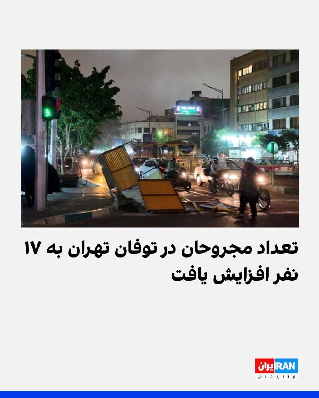

# خواننده تلگرام

<!-- TOP_NAV START -->

<a href="https://github.com/ProAlit/aio-downloader/blob/main/telegram/content/archive_1.md" style="display:inline-block; padding:6px 12px; margin:0 4px; background-color:#2ea44f; color:white; text-decoration:none; border-radius:4px; font-weight:bold;">صفحه بعد</a>

<!-- TOP_NAV END -->

<!-- MSG START -->

---
📅 بروزرسانی: 1405/02/23 07:23
---

## VahidOOnLine — post 239844

  

طبق اعلام اورژانس تهران، شمار مجروحان درپی توفان در پایتخت، به ۱۷ نفر افزایش یافت که شش نفر در محل حادثه درمان شدند و ۱۱ نفر دیگر به مراکز درمانی انتقال یافتند.
به گفته سازمان هواشناسی از غروب سه‌شنبه، وزش باد با سرعت ۵۵ کیلومتر بر ساعت همراه با گردوخاک در تهران آغاز شد و این توفان تا نیمه شب ادامه یافت.

‌🏁 🇬🇧 IranintlTV

🤖 @VahidOOnLine

## VahidOOnLine — post 239843

  

♦️توجه: این متن حاوی جزئیاتی است که می‌تواند آزاردهنده باشد

به گزارش سی‌ان‌ان، گزارش جدیدی نتیجه‌گیری کرده است که شبه‌نظامیان حماس و متحدانشان در جریان و پس از حمله تروریستی ۷ اکتبر ۲۰۲۳ به جنوب اسرائیل، برای «حداکثر کردن رنج و درد» قربانیان، آن‌ها را مورد تجاوز، تعرض و شکنجه جنسی قرار داده‌اند. سرویس جهانی بی‌بی‌سی نیز گزارش مشابهی را با عنوان «تحقیقات اسرائیلی می‌گوید حماس در حملات ۷ اکتبر از خشونت جنسی به‌عنوان سلاح استفاده کرده» منتشر کرده است.
در بخش‌های متعددی از این گزارش ۳۰۰ صفحه‌ای، جزئیاتی حاوی خشونت زیاد مطرح شده که به شدت آزاردهنده‌اند.
در حالی که سازمان ملل و دیگر نهادها گزارش‌هایی درباره خشونت جنسی در جریان این حملات منتشر کرده‌اند ــ حملاتی که در آن حدود ۱۲۰۰ نفر کشته و ۲۵۱ نفر گروگان گرفته شدند ــ این گزارش جامع‌ترین مورد در این زمینه محسوب می‌شود.
این تحقیق بر پایه ۴۳۰ مصاحبه تصویری با بازماندگان و شاهدان، بیش از ۱۰ هزار عکس و ویدئوی ضبط‌شده توسط مهاجمان، و همچنین اسناد رسمی و مواد جمع‌آوری‌شده از محل‌های حمله تهیه شده است.
سی‌ان‌ان می‌نویسد، این گزارش، جامع‌ترین مجموعه شواهد تا به امروز درباره خشونت جنسی و مبتنی بر جنسیت علیه زنان، مردان و کودکان را ارائه می‌دهد و آن را «سیستماتیک، گسترده و بخشی جدایی‌ناپذیر از» این حمله توصیف می‌کند.
کواخاو الکایام-لیوی، نویسنده اصلی و کارشناس حقوق بشر، به سی‌ان‌ان گفت: «مهم‌ترین یافته این است که خشونت جنسی در ۷ اکتبر و علیه گروگان‌ها در اسارت، یک راهبرد حساب‌شده توسط حماس بوده است.»
این گزارش شامل شهادت‌های مستقیم بیش از ۱۰ بازمانده است که در جریان حمله، در زمان ربوده شدن یا هنگام اسارت در غزه، خشونت جنسی شدید و آزار جنسی را تجربه کرده‌اند.
سی‌ان‌ان می‌نویسد، برخی از این جزئیات پس از انتشار گزارش‌های قبلی و همچنین پس از آزادی برخی گروگان‌ها از غزه آشکار شده‌اند. بخشی از آن‌ها از شهادت‌های ارائه‌شده مستقیم به پژوهشگران به دست آمده و بخش دیگر از نشست‌های متعدد با متخصصان پزشکی، وکلای نماینده برخی قربانیان و افراد دیگر جمع‌آوری شده است.
‌🇸🇦 Indypersian

🤖 @VahidOOnLine

## VahidOOnLine — post 239842

  

♦️دونالد ترامپ، رئیس‌جمهوری ایالات متحده، با انتشار پیامی در شبکه اجتماعی «تروث سوشال» با تکذیب گزارش «سی‌ان‌بی‌سی» درباره همراهان خود در سفر به چین، اعلام کرد که مجموعه‌ای از بزرگ‌ترین مدیران اقتصادی آمریکا از جمله جن‌سن هوانگ، ایلان ماسک و تیم کوک او را در این سفر همراهی می‌کنند. ترامپ با «جعلی» خواندن گزارش‌های شبکه «سی‌ان‌بی‌سی» مبنی بر دعوت نشدن مدیرعامل انویدیا، گفت: «مایه افتخار است که جن‌سن، ایلان، تیم اپل، لری فینک و بسیاری دیگر در حال سفر به کشور بزرگ چین هستند؛ جایی که من از رئیس‌جمهور شی خواهم خواست تا فضا را برای این افراد باذکاوت باز کند تا آن‌ها جادوی خود را به کار بگیرند.» او همچنین تاکید کرد که همراهی این نوابغ اقتصادی و همکاری آن‌ها با چین، سطوح جدیدی از پیشرفت را به همراه خواهد داشت و این «اولین درخواست» او از رهبر چین در ساعات آینده خواهد بود.
‌🇸🇦 Indypersian

🤖 @VahidOOnLine

## IranIntlTV — post 336923

  

طبق اعلام اورژانس تهران، شمار مجروحان درپی توفان در پایتخت، به ۱۷ نفر افزایش یافت که شش نفر در محل حادثه درمان شدند و ۱۱ نفر دیگر به مراکز درمانی انتقال یافتند.
به گفته سازمان هواشناسی از غروب سه‌شنبه، وزش باد با سرعت ۵۵ کیلومتر بر ساعت همراه با گردوخاک در تهران آغاز شد و این توفان تا نیمه شب ادامه یافت.

https://iranintl.com/202605135684

---
📅 بروزرسانی: 1405/02/23 07:13
---

## VahidOOnLine — post 239841

  <a href="telegram/content/VahidOOnLine_239841_1778643800.mp4" target="_blank">🎬 Download video</a>

♦️ویدیوهای منتشرشده در شبکه‌های اجتماعی، درگیری میان تماشاگران پس از پایان دیدار دو تیم  النصر و الهلال در دربی ریاض را نشان می‌دهد.
این مسابقه با تساوی به پایان رسید و تعیین قهرمان لیگ عربستان سعودی به هفته پایانی کشیده شد.
‌🇸🇦 Indypersian

🤖 @VahidOOnLine

## VahidOOnLine — post 239840

  

تیم شی‌هی، سناتور جمهوری‌خواه، در مصاحبه با فاکس‌نیوز در واکنش به گزارشی درباره اجازه پاکستان برای استقرار هواپیماهای نظامی ایران در این کشور، به شدت از اسلام‌آباد انتقاد کرد و گفت: «فراموش نکنیم اسامه بن‌لادن یک دهه در پاکستان پنهان بود و این کشور سال‌ها پناهگاه گروه‌های افراطی بوده است.»
او افزود: پاکستان معمولا در برابر آمریکا موضعی محتاطانه و دوپهلو اتخاذ می‌کند.
سناتور با هشدار درباره اینکه جمهوری اسلامی هر توافقی را که صورت گیرد نقض خواهد کرد تاکید کرد که باید برنامه هسته‌ای حکومت ایران را «از نظر فیزیکی ناتوان» از تولید سلاح کرد و توانایی تهران را برای تامین مالی نیروهای نیابتی و تهدید تنگه هرمز از بین برد.

‌🏁 🇬🇧 IranintlTV

🤖 @VahidOOnLine

## IranIntlTV — post 336922

  

تیم شی‌هی، سناتور جمهوری‌خواه، در مصاحبه با فاکس‌نیوز در واکنش به گزارشی درباره اجازه پاکستان برای استقرار هواپیماهای نظامی ایران در این کشور، به شدت از اسلام‌آباد انتقاد کرد و گفت: «فراموش نکنیم اسامه بن‌لادن یک دهه در پاکستان پنهان بود و این کشور سال‌ها پناهگاه گروه‌های افراطی بوده است.»
او افزود: پاکستان معمولا در برابر آمریکا موضعی محتاطانه و دوپهلو اتخاذ می‌کند.
سناتور با هشدار درباره اینکه جمهوری اسلامی هر توافقی را که صورت گیرد نقض خواهد کرد تاکید کرد که باید برنامه هسته‌ای حکومت ایران را «از نظر فیزیکی ناتوان» از تولید سلاح کرد و توانایی تهران را برای تامین مالی نیروهای نیابتی و تهدید تنگه هرمز از بین برد.

https://iranintl.com/202605132603

---
📅 بروزرسانی: 1405/02/23 07:03
---

## VahidOOnLine — post 239839

  

♦️وال استریت ژورنال با اشاره به سفر دونالد ترامپ به چین نوشت، در آستانه ورود رئیس‌جمهوری آمریکا به پکن برای گفت‌وگو با شی جین‌پینگ، رهبر چین، رژیم ایران در حال استفاده از «کارت چین» خود است. براساس این گزارش، سفیر جمهوری اسلامی در چین، در حالی که تلاش می‌کرد از طریق چین پیامی به آمریکا منتقل کند، گفت پکن برای ایران «عمق دیپلماتیک» فراهم می‌کند.
رضا رحمانی فضلی گفت: «پیام ایران روشن است: آتش‌بس دائمی، برقراری یک آتش‌بس پایدار، رفع محاصره و احترام به حقوق مشروع ایران.» او افزود: «چین می‌تواند این پیام را در سطح قدرت‌های بزرگ منعکس کند.»
ایران که بخش عمده نفت خود را به چین صادر می‌کند، این هفته به‌طور علنی از طرح چهار ماده‌ای پکن برای پایان دادن به درگیری حمایت کرد؛ طرحی که هفته گذشته در دیدار وزیران خارجه دو کشور در پایتخت چین مورد بحث قرار گرفت.
‌🇸🇦 Indypersian

🤖 @VahidOOnLine

## IranIntlTV — post 336921

  <a href="telegram/content/IranIntlTV_336921_1778643211.mp4" target="_blank">🎬 Download video</a>

بارش شدید باران روز سه‌شنبه ۲۲ اردیبهشت در استان سامسون ترکیه باعث وقوع سیلاب شد و خانه‌ها و واحدهای تجاری را زیر آب برد. جریان شدید آب خودروها را جابه‌جا کرد و شماری از ساکنان گرفتار شدند.

نیروهای امدادی با کاهش بارش عملیات پاکسازی را آغاز کردند و تاکنون هیچ موردی از تلفات جانی گزارش نشده است.
@iranintltv

---
📅 بروزرسانی: 1405/02/23 06:53
---

هیچ پیام جدیدی در این بروزرسانی ارسال نشد.

---
📅 بروزرسانی: 1405/02/23 06:43
---

## VahidOOnLine — post 239838

  

سی‌ان‌ان به نقل از چند منبع اسرائیلی آگاه گزارش داد اسرائیل نگران است که ترامپ پیش از رسیدگی به برخی از مسائل کلیدی با جمهوری اسلامی، از جمله برنامه‌های هسته‌ای و موشکی بالستیک تهران و حمایت آن از گروه‌های نیابتی، با حکومت ایران به توافق برسد.
به گفته این منابع، چنین توافق ناقصی باعث خواهد شد اسرائیل جنگ را ناتمام تلقی کند.
به گفته یکی از منابع آگاه از گفت‌وگوها، تلقی اسرائیل این است که موضوع موشک‌ها و نیروهای نیابتی «احتمالا از دستور کار خارج شده‌اند»، زیرا به نظر نمی‌رسد در پیش‌نویس‌های اولیه دیپلماتیک گنجانده شده باشند و به همین دلیل نتانیاهو اورانیوم را به عنوان فوری‌ترین تهدید در اولویت قرار داده است.

‌🏁 🇬🇧 IranintlTV

🤖 @VahidOOnLine

## IranIntlTV — post 336920

  

سی‌ان‌ان به نقل از چند منبع اسرائیلی آگاه گزارش داد اسرائیل نگران است که ترامپ پیش از رسیدگی به برخی از مسائل کلیدی با جمهوری اسلامی، از جمله برنامه‌های هسته‌ای و موشکی بالستیک تهران و حمایت آن از گروه‌های نیابتی، با حکومت ایران به توافق برسد.
به گفته این منابع، چنین توافق ناقصی باعث خواهد شد اسرائیل جنگ را ناتمام تلقی کند.
به گفته یکی از منابع آگاه از گفت‌وگوها، تلقی اسرائیل این است که موضوع موشک‌ها و نیروهای نیابتی «احتمالا از دستور کار خارج شده‌اند»، زیرا به نظر نمی‌رسد در پیش‌نویس‌های اولیه دیپلماتیک گنجانده شده باشند و به همین دلیل نتانیاهو اورانیوم را به عنوان فوری‌ترین تهدید در اولویت قرار داده است.

https://iranintl.com/202605131499

---
📅 بروزرسانی: 1405/02/23 06:33
---

هیچ پیام جدیدی در این بروزرسانی ارسال نشد.

---
📅 بروزرسانی: 1405/02/23 06:23
---

## BBCPersian — post 280883

🔻 نیویورک تایمز: ایران هنوز به ۳۰ سکوی موشکی از مجموع ۳۳ سکوی خود در حاشیه خلیج فارس دسترسی دارد

روزنامه نیویورک تایمز در گزارش که روز سه‌شنبه - ۱۲ مه / ۲۲ اردیبهشت - منتشر کرده نوشته ایران همچنان به ۳۰ سکو از ۳۳ سکوی موشکی خود در حاشیه خلیج فارس دسترسی دارد.

این روزنامه آمریکایی نوشته این موضوع از توان بیشتر نظامی ایران نسبت به آنچه ارتش آمریکا و کاخ‌سفید در جریان جنگ مشترک با اسرائیل مدعی نابودی آنها شده بودند، حکایت دارد.

در همین حال، دونالد ترامپ که روز سه‌شنبه برای دیدار با همتای خود - شی جین پینگ - راهی چین شد، در پستی که می‌تواند واکنش به این گزارش نیویورک تایمز تلقی شود گزارش‌هايی را که حاکی از وضعیت نظامی ايران هستند، «اخبار جعلی» توصيف کرده و گفته اين گزارش‌ها به تهران «اميد واهی» می‌دهند.

او چنين پوشش رسانه‌ای را «خيانت» خواند و مدعی شد نيروهای ايرانی متحمل شکست‌های سنگينی شده‌اند.

آقای ترامپ همچنين ادعا کرد ايران پيش‌تر ۱۵۹ شناور نظامی در اختيار داشته، اما «اکنون همه آنها در کف دريا قرار دارند».

او در ادامه مدعی شد ايران ديگر نيروی دريايی موثری ندارد و نيروی هوايی و فناوری‌های نظامی اين کشور نيز «کاملا نابود شده‌اند».

با این حال، پیش‌تر گزارش دیگری که بازتاب گسترده‌ای در رسانه‌های آمریکا داشت مدعی شده بود ایران همچنان تا حدود زیادی توان نظامی خود از جمله موشکی و پهپادی، را حفظ کرده است.

@BBCPersian

## BBCPersian — post 280882

  <a href="https://t.me/bbcpersian/280882" target="_blank">📎 Download file</a>

یک معترض به جنگ آمریکا با ایران در جریان نشستی که روز سه‌شنبه از سوی نشریه پولتیکو و کارخانه تسلیحات‌سازی لاکهید در واشنگتن برگزار شده بود، در میان سخنرانی شاهزاده رضا پهلوی به روبروی صحنه رفت و در حالی که فریاد می‌زد خطاب به او گفت:

«شما کجا بودید وقتی مردم ما داشتند فرزندانشان را از زیر آوار بمب‌هایی که شما به کشورمان دعوت کرده‌اید بیرون می‌کشیدند؟ چطور می‌توانید بگویید «مردم من! ایران من!» و بعد‌ آنها را دعوت به بمباران مردم کنید؟ شرم بر شما!»

ماموران امنیتی خیلی زود این زن معترض را از محل سخنرانی بیرون بردند. با این حال، ویدیو مربوط به این رویداد سه‌شنبه عصر در شبکه‌های اجتماعی بازخورد فراوانی پیدا کرد.

آقای پهلوی در این نشست که چند نفر از وزرا و مقام‌های ارشد فعلی و سابق آمریکا هم در آن شرکت داشتند، در بخشی از سخنان خود از مذاکره با حکومت در ایران پس از آتش‌بس با آمریکا انتقاد کرد و ان را با آنچه تلاش برای نجات مردم ایران از «رژیم» جمهوری اسلامی خواند، در تناقض ارزیابی کرد.

🎥 Bita_4liberation / Instgram
@BBCPersian

---
📅 بروزرسانی: 1405/02/23 06:13
---

## VahidOOnLine — post 239837

  

♦️به گزارش رسانه‌های دولتی چین، وزیر خارجه این کشور از پاکستان خواسته است تلاش‌های میانجیگرانه خود میان رژیم ایران و ایالات متحده را افزایش دهد و به حل «مناسب» موضوع بازگشایی تنگه هرمز کمک کن.
خبرگزاری دولتی شینهوا گزارش داد وانگ یی، وزیر خارجه چین، در تماس تلفنی با اسحاق دار، وزیر خارجه پاکستان، این موضوع را مطرح کرده است؛ تماسی که همزمان با سفر دونالد ترامپ، رئیس‌جمهوری آمریکا، به پکن انجام شد. ترامپ پیش‌تر گفته بود که آتش‌بس بسیار شکننده و مانند بیماری در اتاق مراقبت‌های ویژه به اکسیژن متصل است.
‌🇸🇦 Indypersian

🤖 @VahidOOnLine

---
📅 بروزرسانی: 1405/02/23 06:03
---

## VahidOOnLine — post 239836

♦️هفتادونهمین دوره جشنواره بین‌المللی فیلم کن روز سه‌شنبه، ۲۲ اردیبهشت‌ماه، در حالی آغاز به کار کرد که فرش قرمز آن تحت تاثیر درخشش جواهرات رنگارنگ و حضور چهره‌های ماندگار سینما بود. در مراسم افتتاحیه، الیجا وود جایزه نخل طلای افتخاری یک عمر دستاورد هنری را به پیتر جکسون، کارگردان نامدار سه‌گانه «ارباب حلقه‌ها» اهدا کرد؛ جکسون در سخنرانی خود به خاطره ۲۵ سال پیش و اولین نمایش این سه‌گانه در کن اشاره کرد.
این جشنواره که با حضور ستارگانی چون دمی مور، جین فوندا و هیئت داورانی به ریاست پارک چان-ووک آغاز شده، تا دوم خردادماه ادامه خواهد داشت. برخلاف سال‌های گذشته، مراسم افتتاحیه لحنی آرام‌تر داشت و سیاست در سخنرانی‌ها نقش کم‌رنگی ایفا کرد؛ تنها جین فوندا، بازیگر و فعال سرشناس، در سخنانی کوتاه بر قدرت سینما به عنوان «عمل مقاومت» تاکید کرد و از آزادی و جسارت در خلق اثر هنری سخن گفت. در روزهای آینده، آثار فیلم‌سازان بزرگی چون پدرو آلمودوار و پاوِو پاولیکوفسکی برای کسب نخل طلای امسال به رقابت خواهند پرداخت.
بنیاد فیلم دریای سرخ عربستان سعودی نیز در جشنواره کن با پنج فیلم تحت حمایت‌ «صندوق دریای سرخ» و «بازار دریای سرخ» حضور خواهد داشت. این آثار عبارت‌اند از «داستان‌های موازی» ساخته اصغر فرهادی، «توت‌فرنگی» ساخته لیلا مراکشی، «دیروز چشم نخوابید» ساخته راکان میاسی، «بنیمانا» ساخته ماری کلمنتین دوسابجامبو و «دختر ناشناس» ساخته زو جینگ.
‌🇸🇦 Indypersian

🤖 @VahidOOnLine

## Persian_Trend_Official — post 14024

  <a href="telegram/content/Persian_Trend_Official_14024_1778639627.mp4" target="_blank">🎬 Download video</a>

صبحتون بخیر ☕️

📝 Nick
📌 @persian_trend_official
پرشین ترند | متفاوت‌ترین کانال نظامی

---
📅 بروزرسانی: 1405/02/23 05:53
---

## IranIntlTV — post 336919

  <a href="telegram/content/IranIntlTV_336919_1778638999.mp4" target="_blank">🎬 Download video</a>

حسینعلی حاجی‌دلیگانی و مصطفی طاهری، نمایندگان مجلس، در مصاحبه‌هایی جداگانه درباره افزایش قیمت کالاهای مورد نیاز مردم گفتند ۸۰ درصد گرانی‌ها ارتباطی به جنگ ندارد.

حاجی‌دلیگانی گفت ارز ۲۸ هزار و ۵۰۰ تومانیِ تخصیص‌یافته برای کالاهای اساسی حذف شده و جنگ بهانه است و دولت این کار را عامدانه انجام می‌دهد.

طاهری نیز گفت برخی می‌خواهند القا کنند که افزایش قیمت‌ها به‌خاطر جنگ بوده است.
@iranintltv

---
📅 بروزرسانی: 1405/02/23 05:43
---

## IranianMinds — post 20049

  

🔴 پست‌ جدید ترامپ:

من تورو‌ میخوام !

@IranianMinds

---
📅 بروزرسانی: 1405/02/23 05:35
---

## VahidOOnLine — post 239835

  <a href="telegram/content/VahidOOnLine_239835_1778637935.mp4" target="_blank">🎬 Download video</a>

♦️به گزارش رویترز، دولت عراق عملیات بازسازی و مرمت «زیگورات اور» (The Ziggurat of Ur) در استان «ذی‌قار» را برای مقابله با فرسایش ناشی از تغییرات اقلیمی آغاز کرد. این بنای ۴۰۰۰ ساله که در فهرست میراث جهانی یونسکو به ثبت رسیده، به دلیل وزش بادهای شدید، رطوبت حاصل از بارندگی و نبود موانع طبیعی و کشاورزی در معرض تخریب و فروپاشی قرار گرفته است. کارشناسان باستان‌شناسی با هشدار نسبت به وضعیت اضطراری این سازه، اعلام کردند که در مرحله نخست این پروژه، از روش‌های سنتی و مصالح بومی برای بازسازی بخش‌های آسیب‌دیده استفاده می‌شود تا هویت تاریخی یکی از قدیمی‌ترین تمدن‌های بشری حفظ شود.
عراق که در دهه‌های گذشته آسیب‌های فراوانی را از جنگ‌های پیاپی، از جمله جنگ با ایران متحمل شده است، اکنون با چالش نوین تغییرات اقلیمی دست‌وپنجه نرم می‌کند. زیگورات اور که معبدی هرمی‌شکل برای ستایش خدای ماه (نانا) در دوران سومریان بوده و از آن به عنوان زادگاه «حضرت ابراهیم» یاد می‌شود، یکی از سالم‌ترین نمونه‌های معماری بین‌النهرین باستان است. مقامات عراقی با تخصیص بودجه‌ای اولیه برای این کارزار، امیدوارند تا پایان ماه ژوئیه سال جاری میلادی، روند تخریب این گنجینه تاریخی را متوقف کرده و مسیر را برای نگهداری دوره‌ای آن هموار کنند.
‌🇸🇦 Indypersian

🤖 @VahidOOnLine

## VahidOOnLine — post 239834

  

♦️عربستان سعودی تلاش چهار عامل سپاه پاسداران جمهوری اسلامی برای نفوذ دریایی به کویت را محکوم کرد.
وزارت خارجه عربستان در بیانیه‌ای اعلام کرد: «[پادشاهی عربستان] نفوذ یک گروه مسلح وابسته به سپاه پاسداران به جزیره بوبیان کویت با هدف انجام اقدامات خصمانه علیه کشور برادر، کویت، را محکوم می‌کند.»
ریاض همچنین بار دیگر مخالفت خود را با «این حملات که به حاکمیت کویت آسیب می‌زند» اعلام کرد و افزود چنین «نقض‌هایی تلاش‌های بین‌المللی برای بازگرداندن صلح و ثبات به منطقه را تضعیف می‌کند.»
عربستان سعودی همچنین همبستگی خود را با کویت اعلام و تاکید کرد از هر اقدامی که این کشور برای حفظ حاکمیت، امنیت و ثبات خود انجام دهد، حمایت می‌کند.
‌🇸🇦 Indypersian

🤖 @VahidOOnLine

## FarsiVOA — post 217589

🔺کاهش قیمت نفت در جهان همزمان با سفر پرزیدنت ترامپ به چین

▪️در حالی که سرمایه‌گذاران در انتظار تحولات مربوط به آتش‌بس شکننده میان ایالات متحده و جمهوری اسلامی و سفر دونالد ترامپ، رئیس جمهوری آمریکا، به پکن برای دیدار با شی جین‌پینگ، رئیس‌جمهوری چین، هستند، قیمت آتی نفت روز چهارشنبه ۲۳ اردیبهشت با کاهش رو‌به‌رو شده است.

⬇️ بیشتر بخوانید:
https://ir.voanews.com/a/oil-prices-slip-teetering-iran-ceasefire-trump-heads-china/8149515.html
@FarsiVOA

---
📅 بروزرسانی: 1405/02/23 05:23
---

هیچ پیام جدیدی در این بروزرسانی ارسال نشد.

---
📅 بروزرسانی: 1405/02/23 05:13
---

## VahidOOnLine — post 239833

  

♦️استرالیا قصد دارد یک هواپیمای پیشرفته تجسسی را برای تقویت تلاش‌های چندجانبه در حمایت از عبور کشتی‌ها از تنگه هرمز به خاورمیانه اعزام کند.
ریچارد مارلز، وزیر دفاع استرالیا، پس از نشست مجازی وزیران دفاع کشورهای مختلف در روز سه‌شنبه، برنامه اعزام هواپیمای ای-۷‌ای «وج‌تیل» را اعلام کرد.
این هواپیما که یکی از پیشرفته‌ترین هواپیماهای هشدار زودهنگام و کنترل هوایی جهان محسوب می‌شود، نخستین بار در ماه مارس برای کمک به دفاع از امارات متحده عربی در برابر حملات رژیم ایران به منطقه اعزام شد.
در این نشست، مارلز و همتایانش از بیش از ۴۰ کشور، بار دیگر بر تلاش‌ها برای حمایت از ناوبری در این آبراه در قالب ماموریتی مشترک به رهبری بریتانیا و فرانسه تاکید کردند.
مارلز تاکید کرد ماموریت چندملیتی برای حمایت از عبور و مرور در تنگه هرمز «کاملا دفاعی» خواهد بود.
او گفت: «استرالیا آماده است از یک ماموریت نظامی چندملیتی مستقل و کاملا دفاعی، به رهبری بریتانیا و فرانسه، پس از شکل‌گیری آن حمایت کند.»
‌🇸🇦 Indypersian

🤖 @VahidOOnLine

---
📅 بروزرسانی: 1405/02/23 05:03
---

هیچ پیام جدیدی در این بروزرسانی ارسال نشد.

---
📅 بروزرسانی: 1405/02/23 04:53
---

## VahidOOnLine — post 239832

  

«کنگره ملی کردستان»، نهاد فراگیر تشکل‌های کُرد، با رد اظهارات ترامپ مبنی بر ارائه سلاح به گروه‌های کُرد برای مقابله با جمهوری اسلامی، هشدار داد چنین اظهاراتی خطر ایجاد یک کارزار خصمانه هماهنگ علیه مردم کُرد را به همراه دارد.
این بیانیه افزود: «طرح چنین اتهام‌های گسترده و کلی، همه کردها را در معرض سوءظن قرار می‌دهد و خطر تضعیف روابط کردها و آمریکا را در پی دارد. ما به عنوان کنگره ملی کردستان این اتهام‌ها را رد می‌کنیم و آن‌ها را جدی و بالقوه زیان‌بار می‌دانیم.»

‌🏁 🇬🇧 IranintlTV

🤖 @VahidOOnLine

## FoxNewsTwitter — post 341625

  

Fox News (Twitter/X)

NEW: Dave Venturella is expected to be named the next Acting Director of ICE, replacing Todd Lyons, multiple sources say.

Venturella has been working in the Trump administration as an ICE senior advisor. He was recruited with help from Tom Homan after President Trump was elected.

## IranIntlTV — post 336918

  

«کنگره ملی کردستان»، نهاد فراگیر تشکل‌های کُرد، با رد اظهارات ترامپ مبنی بر ارائه سلاح به گروه‌های کُرد برای مقابله با جمهوری اسلامی، هشدار داد چنین اظهاراتی خطر ایجاد یک کارزار خصمانه هماهنگ علیه مردم کُرد را به همراه دارد.
این بیانیه افزود: «طرح چنین اتهام‌های گسترده و کلی، همه کردها را در معرض سوءظن قرار می‌دهد و خطر تضعیف روابط کردها و آمریکا را در پی دارد. ما به عنوان کنگره ملی کردستان این اتهام‌ها را رد می‌کنیم و آن‌ها را جدی و بالقوه زیان‌بار می‌دانیم.»

https://iranintl.com/202605133079

---
📅 بروزرسانی: 1405/02/23 04:43
---

هیچ پیام جدیدی در این بروزرسانی ارسال نشد.

---
📅 بروزرسانی: 1405/02/23 04:34
---

## VahidOOnLine — post 239831

  

۲۰ عضو دموکرات و جمهوری‌خواه مجلس نمایندگان آمریکا در نامه‌ای به دولت بریتانیا، از این کشور خواستند روند تصویب قانونی قرار دادن سپاه به عنوان یک سازمان «تروریستی» را تسریع کند.
برد شرمن، عضو دموکرات مجلس نمایندگان آمریکا و از مبتکران تهیه این نامه، گفت: «هر روزی که پارلمان بریتانیا تاخیر می‌کند، سپاه پاسداران یک روز دیگر از تاثیر کامل تحریم‌های مشترک ما می‌گریزد. بریتانیا باید در سمت درست تاریخ بایستد و سپاه پاسداران را در ارتباط با اقداماتش در سراسر جهان پاسخگو کند.»
کلودیا تنی، عضو جمهوری‌خواه مجلس نمایندگان و از مبتکران تهیه این نامه، گفت: «سپاه پاسداران یکی از خطرناک‌ترین سازمان‌های تروریستی جهان است و دستانش به خون غیرنظامیان بی‌گناه، آمریکایی‌ها و مخالفان آلوده است.»
او افزود: «حکومت ایران همچنان از طریق سپاه پاسداران و شبکه‌های نیابتی آن، ترور را صادر می‌کند، متحدان ما را تهدید می‌کند و مردم خود را به‌طور بی‌رحمانه سرکوب می‌کند. بریتانیا باید فورا به آمریکا و متحدانش بپیوندد و پیام روشنی بفرستد که جهان غرب ترور، خشونت سیاسی یا یهودستیزی را تحمل نخواهد کرد.»
‌🏁 🇬🇧 IranintlTV

🤖 @VahidOOnLine

## FoxNewsTwitter — post 341624

  

Fox News (Twitter/X)

A mural honoring slain Ukrainian refugee Iryna Zarutska was taken down in Providence, Rhode Island, following intense local backlash.

Some residents and elected officials reportedly complained about the artwork, with the mayor claiming it was "divisive and does not represent" the city.

Eoghan McCabe, the CEO of the AI customer service company Intercom, previously pledged $500k to paint murals honoring her. Elon Musk pledged $1M to the effort.

## IranIntlTV — post 336917

  

۲۰ عضو دموکرات و جمهوری‌خواه مجلس نمایندگان آمریکا در نامه‌ای به دولت بریتانیا، از این کشور خواستند روند تصویب قانونی قرار دادن سپاه به عنوان یک سازمان «تروریستی» را تسریع کند.
برد شرمن، عضو دموکرات مجلس نمایندگان آمریکا و از مبتکران تهیه این نامه، گفت: «هر روزی که پارلمان بریتانیا تاخیر می‌کند، سپاه پاسداران یک روز دیگر از تاثیر کامل تحریم‌های مشترک ما می‌گریزد. بریتانیا باید در سمت درست تاریخ بایستد و سپاه پاسداران را در ارتباط با اقداماتش در سراسر جهان پاسخگو کند.»
کلودیا تنی، عضو جمهوری‌خواه مجلس نمایندگان و از مبتکران تهیه این نامه، گفت: «سپاه پاسداران یکی از خطرناک‌ترین سازمان‌های تروریستی جهان است و دستانش به خون غیرنظامیان بی‌گناه، آمریکایی‌ها و مخالفان آلوده است.»
او افزود: «حکومت ایران همچنان از طریق سپاه پاسداران و شبکه‌های نیابتی آن، ترور را صادر می‌کند، متحدان ما را تهدید می‌کند و مردم خود را به‌طور بی‌رحمانه سرکوب می‌کند. بریتانیا باید فورا به آمریکا و متحدانش بپیوندد و پیام روشنی بفرستد که جهان غرب ترور، خشونت سیاسی یا یهودستیزی را تحمل نخواهد کرد.»
https://iranintl.com/202605139281

---
📅 بروزرسانی: 1405/02/23 04:23
---

## VahidOOnLine — post 239830

  

♦️مراسم افتتاحیه هفتادونهمین دوره جشنواره فیلم کن با حضور چهره‌های برجسته سینمای جهان، روز سه‌شنبه، ۲۲ اردیبهشت‌ماه، آغاز شد. در این مراسم که با استقبال گسترده رسانه‌ها همراه بود، فیصل بالطیور، مدیر اجرایی بنیاد فیلم دریای سرخ، به همراه پیتر جکسون، برنده نخل طلای افتخاری، الایجا وود و اعضای هیئت داوران از جمله پارک چان-ووک، دمی مور و کلوئی ژائو بر روی فرش قرمز حضور یافتند. جشنواره کن به مدت ۱۲ روز ادامه خواهد داشت و دوم خردادماه با معرفی برندگان نخل طلا به کار خود پایان می‌دهد.
بنیاد فیلم دریای سرخ عربستان سعودی در جشنواره کن با پنج فیلم تحت حمایت‌ «صندوق دریای سرخ» و «بازار دریای سرخ» حضور خواهد داشت. این آثار عبارت‌اند از «داستان‌های موازی» ساخته اصغر فرهادی، «توت‌فرنگی» ساخته لیلا مراکشی، «دیروز چشم نخوابید» ساخته راکان میاسی، «بنیمانا» ساخته ماری کلمنتین دوسابجامبو و «دختر ناشناس» ساخته زو جینگ.
‌🇸🇦 Indypersian

🤖 @VahidOOnLine

## FoxNewsTwitter — post 341623

  <a href="telegram/content/FoxNewsTwitter_341623_1778633615.mp4" target="_blank">🎬 Download video</a>

Fox News (Twitter/X)

SPEAKER JOHNSON: “To the families of fallen heroes and those who continue to stand guard in our communities, we have your back.”

House Speaker Mike Johnson lead a ceremony on the Capitol steps to honor law enforcement as part of National Police Week.

Johnson says thanks to the Trump administration, law enforcement deaths reached an 80-year low in 2025, marking a 25% drop from the year before.

---
📅 بروزرسانی: 1405/02/23 04:13
---

## VahidOOnLine — post 239829

  <a href="telegram/content/VahidOOnLine_239829_1778633006.mp4" target="_blank">🎬 Download video</a>

فاطمه مهاجرانی، سخنگوی دولت پزشکیان، درباره قطعی طولانی‌مدت اینترنت در ایران گفت اینترنت حق مردم است و عصبانیت آن‌ها کاملا بجاست، اما در ادامه افزود: «عامل این خشم دشمنانی هستند که باعث می‌شوند فضای امنیتی ما مخدوش شود.»
او همچنین گفت: «رسانه‌ها کمک کنند این ادبیات را جا بیندازیم، دولت طرفدار دسترسی آزاد است؛ همه ما در یک کشتی نشسته‌ایم.»
‌🏁 🇬🇧 IranintlTV

🤖 @VahidOOnLine

## VahidOOnLine — post 239828

  

♦️استیون چونگ، مدیر ارتباطات کاخ سفید، تصویری از مارکو روبیو، وزیر امور خارجه آمریکا، در هواپیمای «ایر فورس وان» منتشر کرد. روبیو که همراه با دونالد ترامپ در مسیر سفر به پکن است، در این تصویر همان مدل لباس ورزشی «نایکی» را به تن دارد که پیش‌تر نیکلاس مادورو، رئیس‌جمهوری ونزوئلا، هنگام بازداشت پوشیده بود.
‌🇸🇦 Indypersian

🤖 @VahidOOnLine

## IranIntlTV — post 336916

  <a href="telegram/content/IranIntlTV_336916_1778633008.mp4" target="_blank">🎬 Download video</a>

فاطمه مهاجرانی، سخنگوی دولت پزشکیان، درباره قطعی طولانی‌مدت اینترنت در ایران گفت اینترنت حق مردم است و عصبانیت آن‌ها کاملا بجاست، اما در ادامه افزود: «عامل این خشم دشمنانی هستند که باعث می‌شوند فضای امنیتی ما مخدوش شود.»
او همچنین گفت: «رسانه‌ها کمک کنند این ادبیات را جا بیندازیم، دولت طرفدار دسترسی آزاد است؛ همه ما در یک کشتی نشسته‌ایم.»

## FarsiVOA — post 217588

⚡️شیوع سویه خطرناک آندِس ویروس هانتا در یک کشتی تفریحی بین‌المللی بار دیگر نگرانی‌ها درباره بیماری‌های نوظهور را افزایش داده است. اکنون چندین کشور در حال انتقال و قرنطینه شهروندان خود هستند. ویروسی نادر که در مواردی حتی می‌تواند از انسان به انسان منتقل شود.
@FarsiVOA

---
📅 بروزرسانی: 1405/02/23 04:04
---

## pm_afshaa — post 90666

  <a href="telegram/content/pm_afshaa_90666_1778632453.webm" target="_blank">🎬 Download video</a>

🔴ترامپ نقشه کشور ونزوئلا رو با طرح پرچم آمریکا و تیتر «پنجاه‌و‌یکمین ایالت» پست کرد :

💧 Rainbet.com the #1 Non-KYC Crypto Casino & Sportsbook @rainbetcom

😁 @Pm_Afshaa

## FarsiVOA — post 217587

⚡️تحقیقات تازه نشان می‌دهد جمهوری اسلامی و نیروهای وابسته به آن با استفاده از شبکه‌های اجتماعی، گروه‌های تبهکار، و نیروهای مزدور، دامنه عملیات جاسوسی و خرابکاری خود را در اروپا گسترش داده‌اند. شبکه‌ای پنهان که از تلگرام آغاز می‌شود و به خیابان‌های لندن و بروکسل می‌رسد.
@FarsiVOA

---
📅 بروزرسانی: 1405/02/23 03:54
---

## FarsiVOA — post 217586

⚡️جمهوری اسلامی از چه طریقی توانسته است به جذب نیرو و تشکیل هسته‌هایی در کشورهای حوزه خلیج فارس اقدام کند؟ گفت‌وگو با حسن هاشمیان
@FarsiVOA

---
📅 بروزرسانی: 1405/02/23 03:46
---

## VahidOOnLine — post 239819

۱۸ و ۱۹ دی، فقط یک تاریخ در تقویم نیست؛
روزی‌ست که برای بعضی خانواده‌ها، همه‌چیز به قبل و بعد از آن تقسیم شد.
از قزوین تا رشت،
از اصفهان تا اراک،
جوان‌هایی با زندگی‌های معمولی، درس، کار، ورزش و رویا،
در چند ساعت از خیابان‌ها حذف شدند.
ریحانه قدسی، سید علیرضا طاهری باجگیرانی، حمزه زینلی، پرنیا شاد بجارکناری، پویا خیرخواه، روبینا امینیان، سید محمدحسین موسوی و پرستو جراحیان
جاویدنامان انقلاب ملی ایرانیان؛
زندگی‌هایی که هر کدام مسیر خودشان را داشتند، اما همگی در خیابان‌های این سرزمین ناتمام ماندند.
#جاویدنامان_انقلاب_ملی_ایرانیان
‌🏁 🇬🇧 IranintlTV

🤖 @VahidOOnLine

## IranIntlTV — post 336907

۱۸ و ۱۹ دی، فقط یک تاریخ در تقویم نیست؛
روزی‌ست که برای بعضی خانواده‌ها، همه‌چیز به قبل و بعد از آن تقسیم شد.
از قزوین تا رشت،
از اصفهان تا اراک،
جوان‌هایی با زندگی‌های معمولی، درس، کار، ورزش و رویا،
در چند ساعت از خیابان‌ها حذف شدند.
ریحانه قدسی، سید علیرضا طاهری باجگیرانی، حمزه زینلی، پرنیا شاد بجارکناری، پویا خیرخواه، روبینا امینیان، سید محمدحسین موسوی و پرستو جراحیان
جاویدنامان انقلاب ملی ایرانیان؛
زندگی‌هایی که هر کدام مسیر خودشان را داشتند، اما همگی در خیابان‌های این سرزمین ناتمام ماندند.
#جاویدنامان_انقلاب_ملی_ایرانیان

## FarsiVOA — post 217585

⚡️قانون‌گذاران کنگره آمریکا در آستانه دیدار پرزیدنت ترامپ و شی جین‌پینگ،‌ رهبران ایالات متحده و چین، دیدگاه‌های‌شان را درباره مهم‌ترین مسائل ژئوپلتیک - از جمله تنش‌های مرتبط با رژیم ایران، جنگ میان اوکراین و روسیه، و موضوع تایوان - بیان کردند.
@FarsiVOA

## FarsiVOA — post 217584

⚡️هشدار درباره بحران‌های فراروی ایران در آستانه تابستان؛ کم‌آبی، خاموشی، و پیامدهای منطقه‌ای
@FarsiVOA

---
📅 بروزرسانی: 1405/02/23 03:34
---

## VahidOOnLine — post 239818

  

♦️به گزارش سی‌ان‌ان به نقل از منابع اسرائیلی، این کشور نگران است که دونالد ترامپ، رئیس‌جمهوری آمریکا، پیش از رسیدگی به برخی از مسائل کلیدی که در وهله نخست باعث آغاز جنگ شد، با رژیم ایران به توافق برسد.
این منابع گفتند توافقی که برنامه هسته‌ای تهران را تا حدی دست‌نخورده باقی بگذارد و در عین حال موضوعاتی مانند موشک‌های بالستیک و حمایت  از نیروهای نیابتی منطقه‌ای را نادیده بگیرد، از نگاه اسرائیل به معنای ناتمام ماندن جنگ خواهد بود.
ترامپ در آغاز جنگ گفته بود که آمریکا می‌خواهد برنامه موشک‌های بالستیک ایران را نابود کند، به حمایت تهران از نیروهای نیابتی منطقه پایان دهد و تاسیسات هسته‌ای ایران را به‌گونه‌ای تعطیل کند که هرگز نتواند به سلاح هسته‌ای دست پیدا کند. اما اکنون، ۱۰ هفته پس از آغاز جنگ، مذاکرات عمدتا بر مسئله اورانیوم ــ به‌ویژه غنی‌سازی آن تا سطح مناسب برای تولید سلاح ــ و بازگشایی تنگه هرمز متمرکز شده است.
یکی از منابع آگاه از مذاکرات گفت اسرائیل می‌داند که موضوع موشک‌ها و نیروهای نیابتی «احتمالا از دستور کار خارج شده‌اند»، زیرا به نظر نمی‌رسد در پیش‌نویس‌های اولیه دیپلماتیک گنجانده شده باشند، و به همین دلیل بنیامین نتانیاهو، نخست‌وزیر اسرائیل، اکنون اورانیوم را فوری‌ترین تهدید می‌داند.
یکی دیگر از مقام‌های اسرائیلی به سی‌ان‌ان گفت: «نگرانی واقعی وجود دارد که ترامپ به یک توافق بد برسد.»
یک مقام ارشد اسرائیلی گفت اسرائیل همچنان برای احتمال شکست مذاکرات در بالاترین سطح آماده‌باش قرار دارد.
او همچنین گفت تشدید درگیری «سناریویی واقع‌بینانه» است «اگر ایرانی‌ها همچنان وقت‌کشی کنند و مذاکرات را طول بدهند.»
‌🇸🇦 Indypersian

🤖 @VahidOOnLine

---
📅 بروزرسانی: 1405/02/23 03:23
---

## VahidOOnLine — post 239817

♦️محمدرضا شهبازی، مجری حکومتی، در واکنش به راه‌اندازی سرویس‌های «مسترکارت» و «ویزا کارت» در سوریه و اینترنت پرسرعت در افغانستان، همزمان با ادامه محدودیت‌های اینترنتی در ایران، گفت: «اگر این‌ها برایتان مهم است، به افغانستان و سوریه بروید.»
این اظهارات در حالی مطرح شد که کشورهای همسایه پس از سال‌ها جنگ و بحران، در حال اتصال دوباره به زیرساخت‌های جهانی و خدمات بانکی بین‌المللی هستند. همزمان، ایران همچنان با فیلترینگ گسترده، محدودیت‌های اینترنتی و انزوای بانکی روبه‌رو است.
‌🇸🇦 Indypersian

🤖 @VahidOOnLine

## FarsiVOA — post 217583

⚡️پس‌لرزه‌های انتخابات محلی بریتانیا؛ بحران سیاسی برای استارمر
@FarsiVOA

---
📅 بروزرسانی: 1405/02/23 03:13
---

## VahidOOnLine — post 239816

♦️وقوع هم‌زمان زمین‌لرزه‌ای به بزرگی ۴.۶ در حوالی پردیس و طوفانی شدید در پایتخت، تهران را در وضعیت اضطراری قرار داده است؛ این در حالی است که به گزارش «نت‌بلاک»، قطع اینترنت جهانی در ایران وارد هفتادوچهارمین روز خود شده و نبود دسترسی به شبکه‌های ارتباطی، اطلاع‌رسانی در این شرایط بحرانی را با اختلال جدی مواجه کرده است. به گفته سخنگوی اورژانس تهران، طوفان دست‌کم ۱۷ مصدوم بر جای گذاشته و لرزش شدید زمین که در بخش‌های وسیعی از شمال و جنوب شرق پایتخت از جمله ورامین و پاکدشت نیز احساس شده، و براساس تصاویر منتشر شده، شهروندان را به خیابان‌ها کشانده است.
‌🇸🇦 Indypersian

🤖 @VahidOOnLine

## FoxNewsTwitter — post 341622

  

Fox News (Twitter/X)

The Justice Department reached a $30M settlement with PayPal over its 2020 $530 million "Economic Opportunity Fund" that allegedly pushed discriminatory investments favoring Black and minority-owned businesses.

As part of the settlement, PayPal will launch a new Small Business Initiative and waive processing fees for $1 billion of transactions, or approximately $30 million, for American businesses that are veteran-owned or engaged in farming, manufacturing, or technology.

Acting Attorney General Todd Blanche touted the ruling stating, "American corporations are on notice: you will face our aggressive enforcement if you use race or national origin to discriminate against qualified Americans."

## FoxNewsTwitter — post 341621

‌Fox News (Twitter/X)

WATCH LIVE: Speaker Johnson honors fallen heroes at National Police Week vigilhttps://x.com/i/broadcasts/1NGaraBYYnlJj

---
📅 بروزرسانی: 1405/02/23 03:03
---

## VahidOOnLine — post 239815

  <a href="telegram/content/VahidOOnLine_239815_1778628823.mp4" target="_blank">🎬 Download video</a>

محمدرضا شهبازی، مجری صداوسیما، در واکنش به انتقادها از وضعیت اینترنت در ایران و مقایسه آن با راه‌اندازی اینترنت ۵جی در افغانستان و آغاز استفاده از کارت‌های بین‌المللی در سوریه، با لحنی تمسخرآمیز گفت: «اگر این چیزها این‌قدر مهم است، بروید همان‌جا (سوریه و افغانستان) زندگی کنید.»
‌🏁 🇬🇧 IranintlTV

🤖 @VahidOOnLine

## FarsiVOA — post 217582

⚡️گشت‌وگذار خبرنگار اسرائیلی در بغداد و اعتراف ارتش عراق به ایجاد پایگاه در صحرای نجف توسط اسرائیل
@FarsiVOA

---
📅 بروزرسانی: 1405/02/23 02:53
---

## IranIntlTV — post 336906

  <a href="telegram/content/IranIntlTV_336906_1778628218.mp4" target="_blank">🎬 Download video</a>

محمدرضا شهبازی، مجری صداوسیما، در واکنش به انتقادها از وضعیت اینترنت در ایران و مقایسه آن با راه‌اندازی اینترنت ۵جی در افغانستان و آغاز استفاده از کارت‌های بین‌المللی در سوریه، با لحنی تمسخرآمیز گفت: «اگر این چیزها این‌قدر مهم است، بروید همان‌جا (سوریه و افغانستان) زندگی کنید.»

## IranIntlTV — post 336905

  <a href="telegram/content/IranIntlTV_336905_1778628220.mp4" target="_blank">🎬 Download video</a>

هزینه‌ای که جمهوری اسلامی به مردم ایران تحمیل کرده، فقط در اقتصاد خلاصه نمی‌شود؛ از سفره‌های کوچک‌تر تا اینترنت طبقاتی، از اعدام و زندان تا ترس، ناامیدی و خشم فروخورده‌ای که هر روز بزرگ‌تر می‌شود. مردم تا کی تاب می‌آورند؟ آیا ایران به نقطهٔ انفجار رسیده است؟ خشم انباشتهٔ مردم چه زمانی فوران خواهد کرد؟

کامبیز حسینی در «برنامه» به این موضوع می‌پردازد.

«یک ایران صدای شما را می‌شنود»

دوشنبه تا پنجشنبه ۱۱ شب تهران

از تلویزیون ایران اینترنشنال

تماشای نسخه کامل این قسمت از «برنامه» در یوتیوب:

https://youtu.be/964Hz45DLwM

@iranintltv

## IranIntlTV — post 336904

  <a href="telegram/content/IranIntlTV_336904_1778628222.mp4" target="_blank">🎬 Download video</a>

عرفان شکورزاده، دانش‌آموختهٔ ۲۹ سالهٔ مهندسی هوافضا از دانشگاه علم‌وصنعت، با اتهام «جاسوسی» اعدام شد؛ اتهامی که جمهوری اسلامی دربارهٔ جزئیات و مدارک آن، توضیح شفافی ارائه نکرده است.

رسانه‌های حکومتی مدعی همکاری او با موساد و آمریکا شدند، اما فعالان حقوق بشر می‌گویند او ماه‌ها در انفرادی بوده و تحت فشار، مجبور به اعتراف اجباری شده است.

کامبیز حسینی در «برنامه» به این موضوع می‌پردازد.

«یک ایران صدای شما را می‌شنود»

دوشنبه تا پنجشنبه ۱۱ شب تهران

از تلویزیون ایران اینترنشنال

تماشای نسخه کامل این قسمت از «برنامه» در یوتیوب:

https://youtu.be/964Hz45DLwM

@iranintltv

---
📅 بروزرسانی: 1405/02/23 02:43
---

## VahidOOnLine — post 239814

  

مایک والتز، سفیر آمریکا در سازمان ملل، با بازنشر تهدیدهای اخیر ابراهیم عزیزی، نماینده مجلس، علیه کشورهای منطقه درباره بستن دائمی تنگه هرمز، در ایکس نوشت جمهوری اسلامی به این دلیل کشورهای منطقه و اقتصاد جهانی را تهدید می‌کند که شورای امنیت مسیر دیپلماسی را انتخاب کرده است.
او نوشت: «جای تعجب ندارد که جمهوری اسلامی آشکارا همسایگان خود را تهدید می‌کند و اذعان می‌کند که به مین‌گذاری در آب‌های بین‌المللی و حمله به کشتی‌های تجاری از سراسر جهان ادامه خواهد داد، با این امید که ویرانی اقتصادی ایجاد کند.»
والتز افزود: «همه این‌ها به این دلیل است که ما در شورای امنیت سازمان ملل مسیر دیپلماسی را انتخاب کرده‌ایم. این اظهارات یک مقام حکومت ایران نشان می‌دهد چرا قطعنامه شورای امنیت علیه تهران لازم است و چرا هرگز به جمهوری اسلامی اجازه داده نخواهد شد به سلاح هسته‌ای دست یابد.»

‌🏁 🇬🇧 IranintlTV

🤖 @VahidOOnLine

## FoxNewsTwitter — post 341620

  <a href="telegram/content/FoxNewsTwitter_341620_1778627611.mp4" target="_blank">🎬 Download video</a>

Fox News (Twitter/X)

FOX NEWS REPORT: There are now 11 suspected cases of Hantavirus worldwide — all among passengers from the MV Hondius cruise ship, reports @BillMelugin_ .

## IranIntlTV — post 336903

  <a href="telegram/content/IranIntlTV_336903_1778627613.mp4" target="_blank">🎬 Download video</a>

سحر از تهران: ۱۸ دی به همسرم چاقو زدند؛ نتوانستیم از عهدهٔ درمانش بربیاییم.از کجا بیاوریم؟

«یک ایران صدای شما را می‌شنود»

دوشنبه تا پنجشنبه ۱۱ شب تهران

از تلویزیون ایران اینترنشنال

تماشای نسخه کامل این قسمت از «برنامه» در یوتیوب:

https://youtu.be/964Hz45DLwM
@iranintltv

## IranIntlTV — post 336902

  

مایک والتز، سفیر آمریکا در سازمان ملل، با بازنشر تهدیدهای اخیر ابراهیم عزیزی، نماینده مجلس، علیه کشورهای منطقه درباره بستن دائمی تنگه هرمز، در ایکس نوشت جمهوری اسلامی به این دلیل کشورهای منطقه و اقتصاد جهانی را تهدید می‌کند که شورای امنیت مسیر دیپلماسی را انتخاب کرده است.
او نوشت: «جای تعجب ندارد که جمهوری اسلامی آشکارا همسایگان خود را تهدید می‌کند و اذعان می‌کند که به مین‌گذاری در آب‌های بین‌المللی و حمله به کشتی‌های تجاری از سراسر جهان ادامه خواهد داد، با این امید که ویرانی اقتصادی ایجاد کند.»
والتز افزود: «همه این‌ها به این دلیل است که ما در شورای امنیت سازمان ملل مسیر دیپلماسی را انتخاب کرده‌ایم. این اظهارات یک مقام حکومت ایران نشان می‌دهد چرا قطعنامه شورای امنیت علیه تهران لازم است و چرا هرگز به جمهوری اسلامی اجازه داده نخواهد شد به سلاح هسته‌ای دست یابد.»

https://iranintl.com/202605120656

## IranIntlTV — post 336901

  <a href="telegram/content/IranIntlTV_336901_1778627615.mp4" target="_blank">🎬 Download video</a>

آیدا از تهران: من ترجیح می‌دهم در راه آزادی کشورم بمیرم تا از گرسنگی

«یک ایران صدای شما را می‌شنود»

دوشنبه تا پنجشنبه ۱۱ شب تهران

از تلویزیون ایران اینترنشنال

تماشای نسخه کامل این قسمت از «برنامه» در یوتیوب:

https://youtu.be/964Hz45DLwM
@iranintltv

<!-- MSG END -->

<!-- NAV START -->

<a href="https://github.com/ProAlit/aio-downloader/blob/main/telegram/content/archive_1.md" style="display:inline-block; padding:6px 12px; margin:0 4px; background-color:#2ea44f; color:white; text-decoration:none; border-radius:4px; font-weight:bold;">صفحه بعد</a>

<!-- NAV END -->
