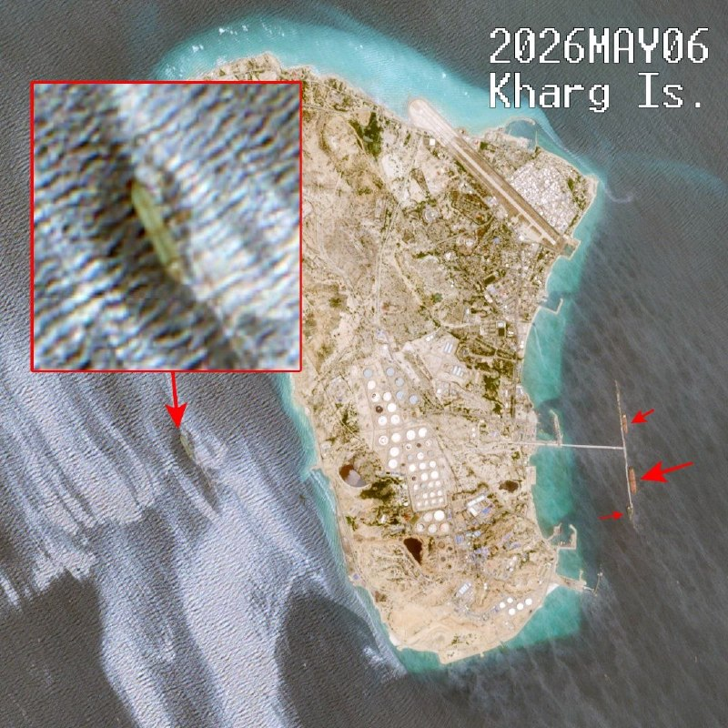

# خواننده تلگرام

<!-- TOP_NAV START -->

<a href="https://github.com/ProAlit/aio-downloader/blob/main/telegram/content/archive_1.md" style="display:inline-block; padding:6px 12px; margin:0 4px; background-color:#2ea44f; color:white; text-decoration:none; border-radius:4px; font-weight:bold;">صفحه بعد</a>

<!-- TOP_NAV END -->

<!-- MSG START -->

---
📅 بروزرسانی: 1405/02/18 19:32
---

## VahidOOnLine — post 238933

  

♦️ تصاویر ماهواره‌ای که بین ۶ تا ۸ می (۱۶ تا ۱۸ اردیبهشت) ثبت شده‌اند، از وقوع یک نشت نفت گسترده در نزدیکی جزیره خارگ، اصلی‌ترین پایانه صادرات نفت ایران، خبر می‌دهند. این لکه نفتی که در تصاویر ماهواره‌های کوپرنیک به‌صورت توده‌ای خاکستری و سفید دیده می‌شود، منطقه‌ای به وسعت تقریبی ۴۵ تا ۹۵ کیلومتر مربع را در غرب این جزیره پوشانده است.

لوییس گودارد، از موسسه تحلیلی «دیتا دسک»، این حادثه را احتمالا بزرگ‌ترین نشت نفتی از زمان آغاز جنگ اخیر توصیف کرده است. لئون مورلند، پژوهشگر رصدخانه درگیری و محیط‌زیست (CEOBS)، نیز تاکید کرد که ماهیت لکه با نفت کاملا همخوانی دارد، هرچند منشا دقیق و علت وقوع آن هنوز مشخص نیست.

جزیره خارگ که مرکز صادرات ۹۰ درصد نفت ایران است، در جریان این جنگ هدف حملات نیروهای آمریکایی قرار گرفته و اکنون تحت محاصره دریایی شدید قرار دارد. در حالی که نیروهای نظامی آمریکا و نمایندگی جمهوری اسلامی در سازمان ملل هنوز واکنشی به این تصاویر نشان نداده‌اند، کارشناسان هشدار می‌دهند که تداوم این وضعیت می‌تواند منجر به یک فاجعه زیست‌محیطی بی‌سابقه در زیست‌بوم حساس خلیج‌فارس شود.
‌🇸🇦 Indypersian

🤖 @VahidOOnLine

## mwarmonitor — post 8710

## pm_afshaa — post 90378

  

رویترز با استناد به تصاویر ماهواره‌ای: نشت مشکوک نفت، 45 کیلومتر مربع در نزدیکی جزیره خارک ایران رو پوشانده

💧 Rainbet.com the #1 Non-KYC Crypto Casino & Sportsbook @rainbetcom

😁 @Pm_Afshaa

## pm_afshaa — post 90377

🔴سی‌ان‌ان: ایران به شناورها هشدار داده که از ناوهای آمریکا دور شوند

💧 Rainbet.com the #1 Non-KYC Crypto Casino & Sportsbook @rainbetcom

😁 @Pm_Afshaa

## VahidOnline — post 75335

  

روح‌الله مومن‌نسب، دبیر ستاد امر به معروف تهران نوشت نمی‌شود نیروهای مسلح، مرزهای ما و تنگه هرمز را به روی دشمنان ببندند اما دولت فضای مجازی را در اختیار آنان قرار دهد.

او افزود که «فضای مجازی به هیچ وجه نباید به حالت قبل برگردد؛ همان‌طور که امام شهید ما به حالت قبل برنمی‌گردد.»
@VahidOOnLine

📡 @VahidOnline

## VahidOnline — post 75334

  

دونالد ترامپ در حساب تروث سوشال خود با انتشار تصویری شبیه‌سازی‌شده از انهدام یک پهپاد ایرانی توسط سلاح لیزری نیروی دریایی آمریکا، سرنگونی پهپادهای جمهوری اسلامی را به «پروانه‌ای که به سمت قبرش سقوط می‌کند»، تشبیه کرد.

او در واکنش به درگیری‌های شبانه ناوشکن‌ها در تنگه هرمز، این تبادل آتش را تنها یک «سیلی از روی محبت» (Love tap) خواند و تاکید کرد که آتش‌بس شکننده منطقه همچنان برقرار است.

سلاحی که ترامپ به آن اشاره می‌کند،سامانه لیزری ضد پهپاد «لوکاست» (LOCUST) است که پیش‌تر اعلام شد بر روی ناو هواپیمابر «یواس‌اس جورج اچ.دبلیو. بوش» نصب و آزمایش شده است.
به گزارش وب‌سایت «وار زون»، این نخستین بار است که یک سلاح انرژی هدایت‌شده روی یک ناو هواپیمابر کلاس نیمیتز نصب می‌شود.

مقامات عالی‌رتبه نیروی دریایی اعلام کرده‌اند که هدف نهایی آن‌ها، تبدیل این سلاح‌های پیشرفته به گزینه اصلی مقابله با تهدیدات نزدیک در آب‌های بین‌المللی است.
@VahidOOnLine

📡 @VahidOnline

## VahidOnline — post 75333

  

فرماندار میناب: حمله آمریکا به یک لنج باری یک کشته و چهار مفقود بر جا گذاشته است

فرماندار میناب می‌گوید که در حملات دیشب آمریکا یک لنج باری هدف قرار گرفته است که منجر به کشته شدن یک ملوان و مفقود شدن چهار نفر دیگر شده است. [گویا قبلا گفته بودند پنج مفقود داشته بعدا جسد یکیشون پیدا شد]

به گفته محمد رادمهر، ۱۰ ملوان دیگر این لنج هم مجروح و به بیمارستان منتقل شدند.

به گفته آقای رادمهر این حمله در نزدیکی آب‌های شهرستان میناب رخ داده است.
عملیات جستجو برای یافتن سایر مفقود‌شدگان ادامه دارد.

دیشب نیروهای ایرانی و آمریکایی در آب‌های جنوبی ایران تبادل آتش کردند، هرچند دونالد ترامپ می‌گوید که آتش‌بس همچنان برقرار است.
آمریکا می‌گوید که نیروهایش «بی‌مقدمه» هدف حمله موشک‌ها، پهپادها و قایق‌های تندرو ایران قرار گرفتند و ایران می‌گوید که حملاتش تلافی‌جویانه و در پاسخ به حمله آمریکا به یک نفتکش ایرانی و یک کشتی دیگر در منطقه تنگه هرمز بوده است.
@VahidHeadline

📡 @VahidOnline

## kianmeli1 — post 87285

  <a href="telegram/content/kianmeli1_87285_1778256173.mp4" target="_blank">🎬 Download video</a>

🔴به عنوان بخشی از دستور اجرایی ترامپ درباره افشای اطلاعات یوفوها، وزارت جنگ آمریکا اولین بخش از پرونده‌های یوفو را منتشر کرد.
https://t.me/kianmeli1

## kianmeli1 — post 87284

🔴بلومبرگ: تنگه هرمز همچنان عملاً بسته است و هیچ ترافیک کشتی‌ از سه‌شنبه تاکنون وارد یا خارج نشده است.
https://t.me/kianmeli1

## kianmeli1 — post 87283

🔴وزارت امور خارجه آمریکا اعلام کرد، مسافران آمریکایی یک کشتی کروز که در آن ویروس هانتا شیوع پیدا کرده است، به کشورشان بازگردانده خواهند شد.
https://t.me/kianmeli1

## kianmeli1 — post 87282

‏🔴خبرگزاری تسنیم به نقل از یک منبع نظامی نوشت در حال حاضر درگیری‌ها در خلیج فارس متوقف شده است، اما در صورت ورود دوباره نیروهای آمریکایی به این منطقه به آن‌ها پاسخ «قاطع» داده می‌شود
https://t.me/kianmeli1

## IranIntlTV — post 336166

  <a href="telegram/content/IranIntlTV_336166_1778256176.mp4" target="_blank">🎬 Download video</a>

یک شهروند با ارسال پیامی به ایران‌اینترنشنال از افزایش شدید قیمت خدمات درمانی روایت کرده و می‌گوید قیمت هر جلسه شیمی‌درمانی به ۷۰۰ میلیون تومان رسیده است.

## IranIntlTV — post 336165

  <a href="telegram/content/IranIntlTV_336165_1778256178.mp4" target="_blank">🎬 Download video</a>

در حالی که جمهوری اسلامی در جریان انقلاب ملی دست به گسترده‌ترین سرکوب معاصر زد، همچنان از برگزاری ساده‌ترین مراسم‌ بر مزار جان‌باختگان نیز جلوگیری می‌کند.
گفت‌وگو با رضا حاجی‌حسینی، روزنامه‌نگار
@iranintltv

## alonews — post 118704

  <a href="telegram/content/alonews_118704_1778256180.webm" target="_blank">🎬 Download video</a>

👈تسنیم: درگیری‌ها در خلیج فارس فعلاً متوقف شده اما احتمال آغاز مجدد آن وجود دارد

✅ @AloNews خبر جنگ

## alonews — post 118703

  <a href="telegram/content/alonews_118703_1778256181.webm" target="_blank">🎬 Download video</a>

👈سخنگوی وزارت خارجه: اقدام دیشب آمریکا، هم نقض آتش‌بس بود و هم نقض فاحش منشور سازمان ملل

✅ @AloNews خبر جنگ

## alonews — post 118702

  <a href="telegram/content/alonews_118702_1778256181.webm" target="_blank">🎬 Download video</a>

👈سی‌ان‌ان: ایران به شناورها هشدار داده که از ناوهای آمریکا دور شوند

✅ @AloNews خبر جنگ

---
📅 بروزرسانی: 1405/02/18 19:22
---

## VahidOOnLine — post 238932

  

♦️ محمد رادمهر، فرماندار میناب در استان هرمزگان، اعلام کرد که نیروهای امدادی موفق شدند پیکر یکی از پنج ملوانی را که در پی حمله شبانه ایالات متحده به شناور ایرانی در محدوده تنگه هرمز مفقود شده بودند، پیدا کنند.

خبرگزاری مهر به نقل از رادمهر گزارش داد که تیم‌های جست‌وجو و نجات همچنان در تلاش برای یافتن چهار ملوان دیگر هستند که سرنوشت آن‌ها نامشخص است. پیش از این نیز فرماندار میناب تایید کرده بود که در جریان درگیری‌های پنجشنبه‌شب، ۱۰ ملوان دیگر مجروح و به مراکز درمانی منتقل شده‌اند.
‌🇸🇦 Indypersian

🤖 @VahidOOnLine

## VahidOOnLine — post 238931

  

رویترز گزارش داد که بر اساس تصاویر ماهواره‌ای، در نزدیکی جزیره خارک، یکی از مراکز اصلی نفتی ایران، احتمال نشت نفت در دریا وجود دارد. در این تصاویر که بین ۱۶ تا ۱۸ اردیبهشت توسط ماهواره‌های کاپرنیکوس ثبت شده، لکه‌ای خاکستری و سفید در آب‌های غرب این جزیره دیده می‌شود.

پژوهشگر «رصدخانه منازعه و محیط زیست» گفته است که این لکه از نظر ظاهری با نفت مطابقت دارد و حدود ۴۵ کیلومتر مربع از سطح دریا را پوشش می‌دهد.
‌🏁 🇬🇧 IranintlTV

🤖 @VahidOOnLine

## mwarmonitor — post 8709

🔴سپاه پاسداران انقلاب اسلامی (IRGC) از طریق رادیو پیامی برای شناورها ارسال کرده و به آن‌ها توصیه کرده است که برای «امنیت خود» ۱۰ مایل از ناوهای جنگی آمریکا فاصله بگیرند، «زیرا گاهی لازم است به یانکی‌ها با موشک‌ها و پهپادها درس داده شود» - CNN

@mwarmonitor

## mwarmonitor — post 8708

  

📝بامزیِ قصه‌ی ما که ظاهراً دُز عسلِ قدرتش بالا زده، با همان چشمان خمار و ژستِ «فیلسوفِ کوچه بن‌بست»، دوباره پشت میکروفون رفته تا دنیا را با پوشک گره بزند. جناب مخبر مدعی شده تنگه هرمز مثل بمب اتم است؛ احتمالا به این دلیل که هر دو مورد در دستان مدیریتِ فاجعه‌بار ایشان، فقط پتانسیل نابودی زندگی خودی‌ها را دارد!
🔸​بزرگوار، شما که در تنظیم بازار پیاز و مرغ، در حد فدراسیون تیله‌بازی هم اقتدار نداری، چطور از تحت تأثیر قرار دادن اقتصاد جهان حرف می‌زنی؟ تهدید به «تنبیه امارات» هم بیشتر شبیه پارس کردن سگی است که قلاده‌اش در دست همان صاحب‌خانه است؛ چرا که نیمی از دارایی‌های رفقایتان در همان دبی زیر آفتاب استراحت می‌کند. حقیقت تلخ اینجاست که تنگه هرمز بمب اتم نیست، اما دهانِ باز و مغزِ متوهمِ مسئول بی‌کفایتی مثل شما، دقیقاً همان سلاح کشتار جمعی است که سال‌هاست زندگی مردم ایران را به خاکستر نشانده است. در دنیای فانتزی خودت خوش باش خرسِ متوهم، اما بدان که با این دست‌فرمان، تنها چیزی که منفجر می‌شود، آستانه تحمل مردمی است که از اراجیف استراتژیک شما جان به لب شده‌اند.

@mwarmonitor

## pm_afshaa — post 90376

🔴بلومبرگ:تنگه هرمز عملاً همچنان بسته است و از سه‌شنبه هیچ عبور و مرور کشتی‌ها به داخل یا خارج ثبت نشده

💧 Rainbet.com the #1 Non-KYC Crypto Casino & Sportsbook @rainbetcom

😁 @Pm_Afshaa

## VahidOnline — post 75328

  <a href="telegram/content/VahidOnline_75328_1778255548.mp4" target="_blank">🎬 Download video</a>

مارکو روبیو، وزیر امور خارجه آمریکا، گفت اقدام نظامی آمریکا علیه ایران در بامداد جمعه «جدا و متمایز» از عملیات «خشم حماسی» بوده و ایالات متحده همچنان به‌صورت «دفاعی» واکنش نشان خواهد داد.

روبیو روز جمعه در شهر رم، پایتخت ایتالیا، در جمع خبرنگاران اعلام کرد «خشم حماسی» که او اوایل این هفته گفته بود به پایان رسیده است، «یک عملیات تهاجمی بود که برای نابودی سکوهای پرتاب موشک، نیروی دریایی و نیروی هوایی آن‌ها طراحی شده بود.»
او افزود آنچه ساعاتی پیش رخ داد «ناوشکن‌های آمریکایی بودند که در آب‌های بین‌المللی در حال حرکت بودند و از سوی ایرانی‌ها به آن‌ها شلیک شد، و آمریکا برای حفاظت از خود به‌صورت دفاعی پاسخ داد.»
دیپلمات ارشد آمریکا گفت: «فقط کشورهای احمق وقتی به آن‌ها شلیک می‌شود، پاسخ نمی‌دهند. و ما کشور احمقی نیستیم.»

وقتی از روبیو پرسیده شد که آیا آمریکا خطوط قرمزی را به ایران منتقل کرده است یا نه، پاسخ داد: «خط قرمز روشن است: اگر آمریکایی‌ها را تهدید کنند، نابود خواهند شد.»
وزیر خارجه آمریکا همچنین خبر داد که واشینگتن انتظار دارد روز جمعه پاسخ ایران به پیشنهاد واشینگتن برای پایان دادن به جنگ را دریافت کند.
روبیو در این زمینه توضیح داد: «خواهیم دید که این پاسخ شامل چه چیزهایی است. امید ما این است که چیزی باشد که بتواند ما را وارد یک روند جدی مذاکره کند.»
او همچنین تلاش‌های ایران برای کنترل تنگه هرمز را محکوم کرد و گفت: «ایران اکنون ادعا می‌کند که مالک این آبراه بین‌المللی است و حق کنترل آن را دارد... این اقدامی غیرقابل قبول است که آن‌ها تلاش دارند آن را عادی جلوه دهند.»
@VahidHeadline

📡 @VahidOnline

## kianmeli1 — post 87281

‏🔴محمد مخبر، دستیار رهبر جمهوری اسلامی: تنگه هرمز امکانی در حد بمب اتم دارد و با یک تصمیم می‌توان اقتصاد جهان را تحت تاثیر قرار داد
https://t.me/kianmeli1

## kianmeli1 — post 87280

‏🔴زمین‌لرزه‌ای به بزرگی ۳.۹ در عمق ۶ کیلومتری، عصر جمعه خوی را لرزاند
https://t.me/kianmeli1

## kianmeli1 — post 87279

‏🔴زمین‌لرزه‌ای به بزرگی ۳.۷ عصر جمعه خرم‌آباد را لرزاند
https://t.me/kianmeli1

## kianmeli1 — post 87278

‏🔴وزیر علوم جمهوری اسلامی: هنوز درباره مجازی یا حضوری بودن امتحانات دانشگاه‌ها تصمیمی نگرفته‌ایم
https://t.me/kianmeli1

## kianmeli1 — post 87277

‏🔴اکسیوس گزارش داد که جی‌دی ونس، معاون رییس‌جمهور آمریکا، در نشستی با نخست‌وزیر قطر برای گفت‌وگو درباره مذاکرات با جمهوری اسلامی حضور دارد
https://t.me/kianmeli1

## kianmeli1 — post 87276

‏🔴معاون استاندار هرمزگان: از شنبه ۱۹ اردیبهشت ادارات استان با ۵۰ درصد حضور و ۵۰ درصد دورکاری فعالیت می‌کنند و ساعت کار دستگاه‌های اجرایی از ۸ تا ۱۳ تعیین شده است
https://t.me/kianmeli1

## IranIntlTV — post 336164

  <a href="telegram/content/IranIntlTV_336164_1778255549.mp4" target="_blank">🎬 Download video</a>

نتایج اولیه انتخابات شوراهای محلی در انگلستان نشان می‌دهد حزب راستگرای اصلاح توانسته دستاوردهای قابل توجهی کسب کند و حزب کارگر در چندین منطقه کرسی از دست بدهد.
گفت‌وگو با شهران طبری، روزنامه‌نگار و تحلیل‌گر سیاسی
@iranintltv

## IranIntlTV — post 336163

  

رویترز گزارش داد که بر اساس تصاویر ماهواره‌ای، در نزدیکی جزیره خارک، یکی از مراکز اصلی نفتی ایران، احتمال نشت نفت در دریا وجود دارد. در این تصاویر که بین ۱۶ تا ۱۸ اردیبهشت توسط ماهواره‌های کاپرنیکوس ثبت شده، لکه‌ای خاکستری و سفید در آب‌های غرب این جزیره دیده می‌شود.

پژوهشگر «رصدخانه منازعه و محیط زیست» گفته است که این لکه از نظر ظاهری با نفت مطابقت دارد و حدود ۴۵ کیلومتر مربع از سطح دریا را پوشش می‌دهد.
https://iranintl.com/202605080464

## FarsiVOA — post 217202

وزیر خارجه آمریکا در رم گفت واشنگتن امروز پاسخ جمهوری اسلامی به طرح پیشنهادی صلح را دریافت می‌کند و ابراز امیدواری کرد تهران با «پاسخی جدی» زمینه ورود به مذاکرات جدی را فراهم کند.

## IranianMinds — post 19808

  

خورشید مردم ایران دوباره طلوع می کند و بر تاریکی جمهوری ستمگر اسلامی پیروز خواهد شد.

@IranianMinds

## BBCPersian — post 280512

🔻خبرگزاری فارس: درگیری‌های پراکنده در تنگه هرمز در جریان است

خبرگزاری فارس وابسته به سپاه پاسداران انقلاب اسلامی می‌گوید «از ساعتی پیش درگیری‌های پراکنده‌ای میان نیروهای مسلح ایران و شناورهای آمریکایی‌ در محدودهٔ تنگهٔ هرمز در جریان است.»

جزئیات بیشتری از این درگیری از سوی ایران منتشر نشده است. مقام‌های آمریکایی هم در این زمینه اظهارنظری نکرده‌اند.

ایران و آمریکا شب گذشته در خلیج فارس تبادل آتش کردند اما هر دو کشور دیگری را آغازگر آن خواندند.

آمریکا گفته است با وجود این درگیری، آتش‌بس نقض نشده و همچنان جریان دارد.

https://bbc.in/4cZY32k
@BBCPersian

## BBCPersian — post 280511

🔻لبنان: چهار نفر در حمله هوایی کشته شدند؛ اسرائیل: چندین پرتابه از سمت لبنان شلیک شد

به گفته وزارت بهداشت لبنان، در حمله هوایی امروز به شهر طورا در جنوب این کشور، چهار نفر از جمله دو زن کشته شدند.

خبرگزاری دولتی لبنان و خبرگزاری فرانسه هم گزارش دادند که اسرائیل در حال انجام حملات گسترده در این منطقه بوده است.

اسرائیل در این باره اظهارنظر نکرده است اما در گزارش دیگری ارتش این کشور اعلام کرد پس از شلیک پرتابه از لبنان، آژیرهای هشدار حمله هوایی در چندین شهر شمالی این کشور به صدا درآمد.

در بیانیه ارتش اسرائیل آمده است که پس از فعال شدن آژیرها، «چندین پرتابه به سمت خاک اسرائیل شناسایی شد.»

این بیانیه افزود: «نیروی هوایی اسرائیل یکی از پرتابه‌ها را رهگیری کرد و سایر پرتابه‌ها در مناطق باز فرود آمدند. به کسی آسیب نرسید.»

ارتش اسرائیل جزئیات بیشتری ارائه نکرد.

با وجود آتش‌بس در جنگ میان اسرائیل و حزب‌الله، درگیری‌ها در جنوب لبنان متوقف نشده است.

https://bbc.in/4cZY32k
@BBCPersian

## Dirty_Kids — post 389113

دولت آمریکا اقدام به انتشار تصاویر و فیلم های مرتبط با UFO کرده. از نکات جالب این اسناد تصاویر گرفته شده در مأموریت آپولو 12 در سال 1969 بر روی ماه هست که به طور واضح اشیاء ناشناس در عکس ها دیده میشه

@Dirty_Kids 👻

## Hranews — post 112831

  

در هفته‌ای که گذشت؛ نگاهی به گزارشات محیط زیستی در ایران

❗️
❗️
❗️
❗️
❗️ – حق بر #محیط_زیست و مبانی فلسفی آن، از قواعد #حقوق_بشر و حقوق طبیعی نشأت گرفته شده است. ابتدایی ترین حق طبیعی انسان در این کره خاکی، «حق حیات» است. اما طی دهه‌های اخیر به دلیل استفاده بی‌رویه از منابع طبیعی، عدم نظارت و توجه به مباحث زیست محیطی و الگوهای صحیح، محیط زیست طبیعی به‌شدت آسیب دیده است. گزارش پیش رو حاصل ثبت ۶۵ گزارش محیط زیستی ایران است که در هفته‌ اخیر منتشر و به هدف آگاه‌سازی گردآوری شده است.

به گزارش خبرگزاری هرانا، ارگان خبری مجموعه فعالان حقوق بشر در ایران، در هفته‌‌ای که گذشت لاشه سه قلاده فوک خزری کشف شد. همچنین، بیش از ۵۴ شکارچی و صیاد غیرمجاز و قاچاقچی چوب بازداشت و به مراجع قضایی معرفی شدند. افزون بر این، بر اساس گزارشات منتشر شده، بیش از ۵۵ تن چوب قاچاق کشف و ضبط شد. از سوی دیگر، شاخص کیفی هوا دستکم در ۳۰ شهر ناسالم و خطرناک اعلام شد. از دیگر اخبار مرتبط با محیط زیست میتوان به بحران خشکسالی، پسماندها و آلاینده‌ها در مناطق مختلف اشاره کرد؛ در گزارش پیش رو به برخی از آنها پرداخته شده است.

آسیب رسانی به جنبه های مختلف محیط زیست در ایران کماکان ادامه دارد. از طرفی شهروندانی وجود دارند که به دلیل عدم آموزش یا نیازهای مالی دست به تخریب و آسیب رسانی به محیط زیست می زنند و از سوی دیگر نهادهای متولی در تلاش هستند تا از حجم این آسیب ها بکاهند، هر چند این تلاش ها قابل تقدیر است اما به نظر نمی آید میزان آن با شرایط محیط زیستی ایران تطبیق داشته باشد.

ادامه مطلب

↘️
@hranews_bot تماس ✉️ -  @Hranews  کانال هرانا 🆑

## alonews — post 118701

  <a href="telegram/content/alonews_118701_1778255552.webm" target="_blank">🎬 Download video</a>

👈حسن قشقاوی، عضو کمیسیون امنیت ملی مجلس: آمریکا ۴۸ ساعت پیش ادعا کرد عملیات موسوم به «آزادی» را متوقف می‌کند و منتظر پاسخ دیپلماتیک ایران است، اما دیشب دست به اقدام نظامی زد.

✅ @AloNews خبر جنگ

## alonews — post 118700

  <a href="telegram/content/alonews_118700_1778255552.webm" target="_blank">🎬 Download video</a>

👈نیویورک تایمز: ترامپ کنترل خود را بر حزب جمهوری‌خواه از طریق ترکیبی از تطمیع و ارعاب اعمال کرد؛ کسانی که با او همسو هستند، نفوذ، حمایت و فرصت‌های سیاسی به دست می‌آورند، در حالی که کسانی که با او مخالفند با انزوای سختی روبرو می‌شوند که می‌تواند به حرفه سیاسی آنها پایان دهد

✅ @AloNews خبر جنگ

## alonews — post 118699

  <a href="telegram/content/alonews_118699_1778255553.webm" target="_blank">🎬 Download video</a>

⚽️🇮🇷بالاخره یه حریف تدارکاتی واسه تیم‌ملی قبل جام جهانی پیدا شد؛ تیمِ مخوف گامبیا🇬🇲حاضر شده قبل جام جهانی با ایران بازی دوستانه برگزار کنه. @AloSport

<!-- MSG END -->

<!-- NAV START -->

<a href="https://github.com/ProAlit/aio-downloader/blob/main/telegram/content/archive_1.md" style="display:inline-block; padding:6px 12px; margin:0 4px; background-color:#2ea44f; color:white; text-decoration:none; border-radius:4px; font-weight:bold;">صفحه بعد</a>

<!-- NAV END -->
